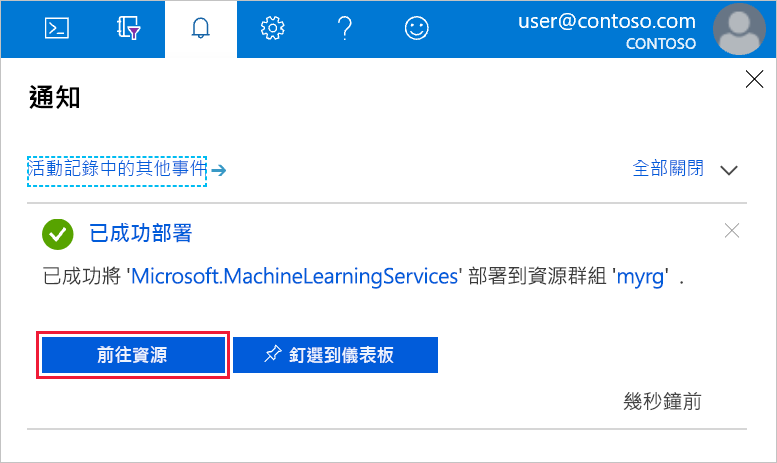

使用您將使用之 Azure 訂用帳戶的認證來登入 [Azure 入口網站](https://portal.azure.com/)。 如果您沒有 Azure 訂用帳戶，請立即建立[免費帳戶](https://azure.microsoft.com/free/?WT.mc_id=A261C142F)。

只有在 Edge、Chrome 與 Firefox 瀏覽器上才支援入口網站的工作區儀表板。

   

選取入口網站左上角的 [建立資源] 按鈕 (+)。

   

在搜尋列中輸入「Machine Learning」。 選取名為 **Machine Learning 工作區**的搜尋結果。

   

在 [Machine Learning 工作區] 窗格中，捲動至底部並選取 [建立] 以開始。

   

在 [ML 工作區] 窗格中，設定您的工作區。

   欄位|說明
   ---|---
   工作區名稱 |輸入可識別您工作區的唯一名稱。  這裡我們使用 docs-ws。 名稱必須是整個資源群組中唯一的。 請使用可輕鬆回想並與其他人所建立之工作區有所區別的名稱。  
   訂用帳戶 |選擇您要使用的 Azure 訂用帳戶。 如果您有多個訂用帳戶，請選擇資源計費的適當訂用帳戶。
   資源群組 | 在您的訂用帳戶中使用現有的資源群組，或輸入名稱來建立新的資源群組。 資源群組是存放 Azure 方案相關資源的容器。  這裡我們使用 docs-aml。 
   位置 | 選擇最接近您的使用者與資料資源的位置。 這是建立工作區的位置。

   

選取 [建立] 來開始建立程序。  建立工作區可能需要一些時間。

   若要檢查部署狀態，請選取工具上的通知圖示 (鈴鐺)。

   

   完成時，會出現部署成功的訊息。  它也會出現在通知區段。   按一下 [前往資源] 按鈕以檢視新的工作區。
