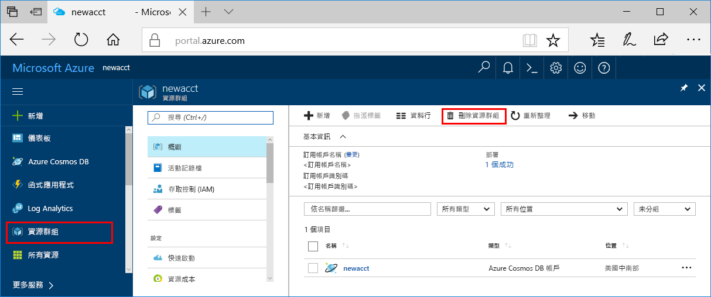

>[!IMPORTANT]
>您所建立的資源可用來作為其他 Azure Machine Learning 服務教學課程和操作說明文章的先決條件。 

如果您不打算使用您在此建立的資源，請刪除它們，以免產生任何費用。

1. 在 Azure 入口網站中，選取最左邊的 [資源群組]。
 
   

1. 在清單中，選取您所建立的資源群組。

1. 選取 [刪除資源群組]。

1. 輸入資源群組名稱，然後選取 [刪除]。

   如果看見「必須先刪除巢狀資源，才能刪除資源」錯誤訊息，則必須先刪除任何巢狀資源。 如需有關刪除巢狀資源的資訊，請參閱[此疑難排解章節](../articles/machine-learning/desktop-workbench/known-issues-and-troubleshooting-guide.md#cant-delete-experimentation-account)。 
