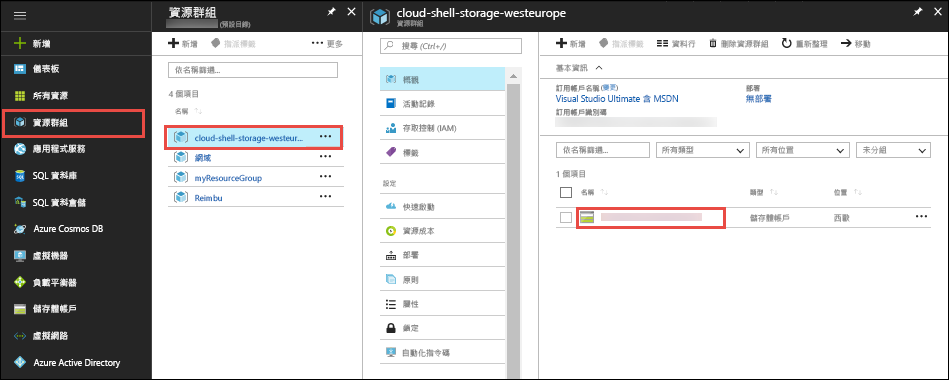
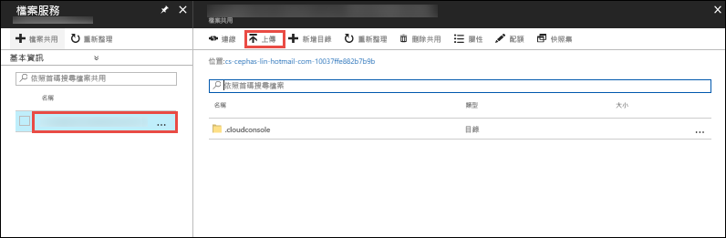

在 [Azure 入口網站](https://portal.azure.com)中，按一下 [資源群組] > **cloud-shell-storage-\<your_region>** > **\<storage_account_name>**。



在儲存體帳戶的 [概觀]  頁面中，選取 [檔案]。

選取自動產生的檔案共用，然後選取 [上傳]。 此檔案共用掛接在 Cloud Shell 中作為 `clouddrive`。



按一下檔案選取器並選取您的 ZIP 檔案，然後按一下 [上傳]。 

在 Cloud Shell 中，使用 `ls` 來確認您可以在預設的 `clouddrive` 共用中看見已上傳的 ZIP 檔案。

```azurecli-interactive
ls clouddrive
```
