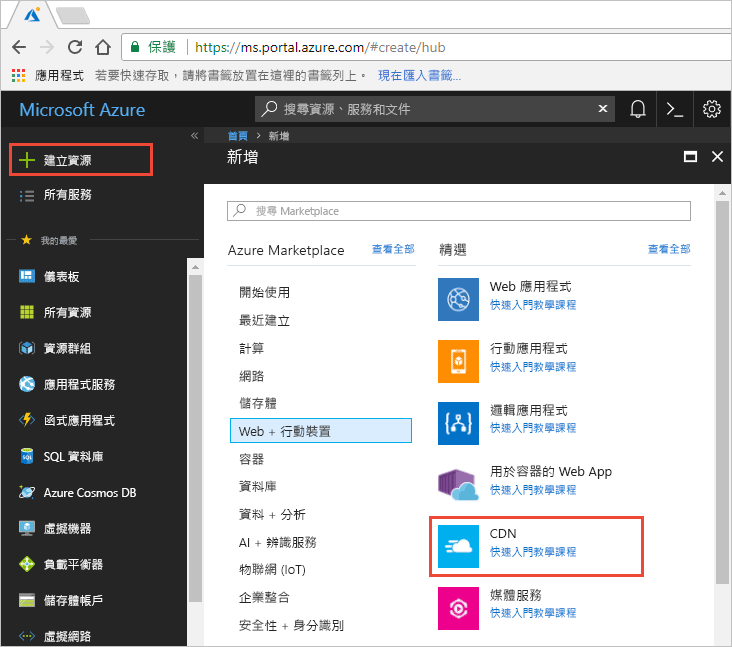
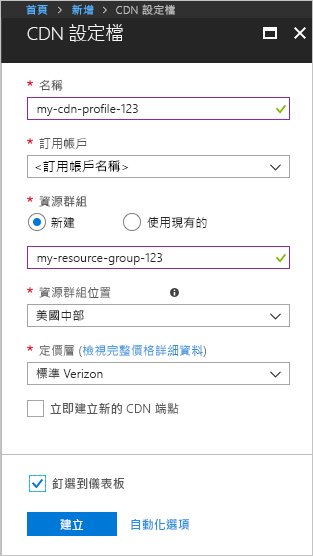

## 建立新的 CDN 設定檔

CDN 設定檔是 CDN 端點的容器，會指定定價層。

1. 在 Azure 入口網站的左上方，選取 [建立資源]。
    
    [新增] 窗格隨即出現。
   
2. 選取 [Web + 行動]，然後選取 [CDN]。
   
    

    此時會顯示 [CDN 設定檔] 窗格。

    使用影像下方的資料表中指定的設定。
   
    

    | 設定  | 值 |
    | -------- | ----- |
    | **名稱** | 輸入 *my-cdn-profile-123* 作為設定檔名稱。 此名稱必須是全域唯一的；如果已在使用中，您可以輸入不同名稱。 |
    | **訂用帳戶** | 從下拉式清單中，選取 Azure 訂用帳戶。|
    | **資源群組** | 選取 [新建]，並輸入 *my-resource-group-123* 作為資源群組名稱。 此名稱必須是全域唯一的；如果已在使用中，您可以輸入不同名稱。 | 
    | **資源群組位置** | 從下拉式清單中選取 [美國中部]。 |
    | **定價層** | 從下拉式清單中選取 [標準 Verizon]。 |
    | **立即建立新的 CDN 端點** | 保留為未選取。 |  
   
3. 選取 [釘選至儀表板]，以在設定檔建立後將其儲存至儀表板。
    
4. 選取 [建立] 以建立設定檔。 

