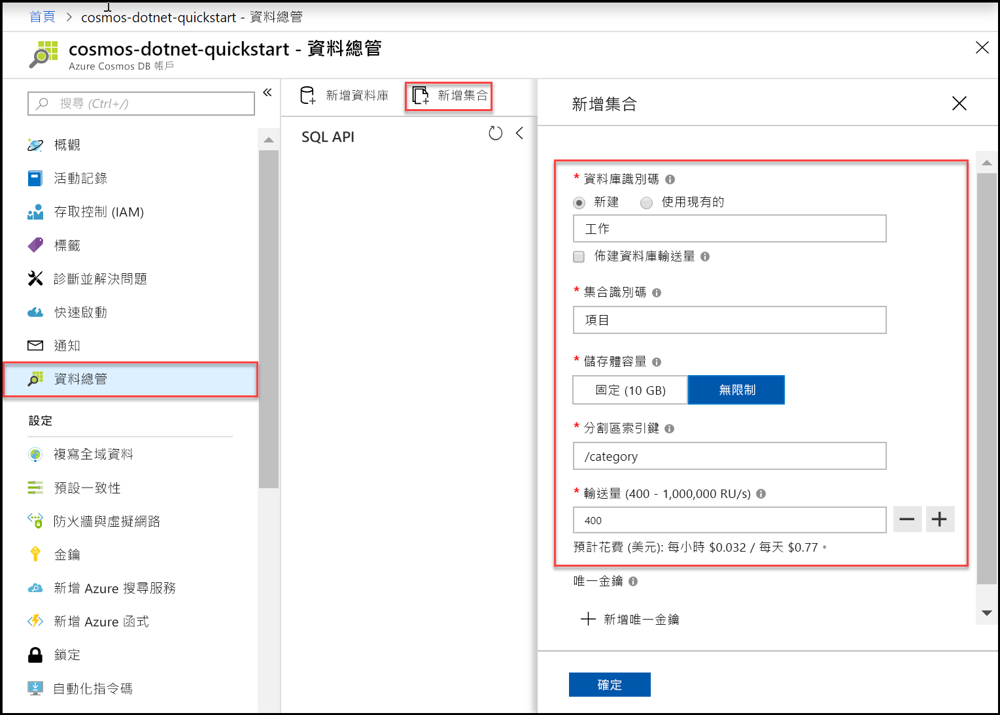

您現在可以在 Azure 入口網站中使用 [資料總管] 工具，建立資料庫和集合。 

1. 按一下 [資料總管] > [新增集合]。 
    
    [新增集合] 區域會顯示在最右邊，您可能需要向右捲動才能看到它。

    

2. 在 [新增集合] 頁面上，輸入新集合的設定。

    設定|建議的值|說明
    ---|---|---
    資料庫識別碼|*工作*|輸入 *Tasks* 作為新資料庫的名稱。 資料庫名稱必須包含從 1 到 255 個字元，且不能包含 /、\\、#、? 或尾端空格。
    集合識別碼|*項目*|輸入 *Items* 作為新集合的名稱。 集合識別碼與資料庫名稱具有相同的字元需求。
    佈建資料庫輸送量|保留空白|Azure Cosmos DB 可以在資料庫層級 (資料庫中的所有集合會共用相同的輸送量) 或集合層級佈建輸送量。 若保留空白，則會在集合層級為此特定集合佈建輸送量。
    儲存體容量|*無限制*|選擇 [無限制] 的儲存體容量。 
    資料分割索引鍵|/category|輸入 "/category" 作為資料分割索引鍵。 設定資料分割索引鍵可讓 Azure Cosmos DB 調整集合的大小，以符合您應用程式的儲存體和輸送量需求。 一般情況下，所選擇的資料分割索引鍵最好是有各種不同值的索引鍵，這樣的選擇會導致系統平均地對工作負載分配儲存體和要求數量。 [深入了解資料分割。](../articles/cosmos-db/partitioning-overview.md)
    Throughput|400 RU/秒|將輸送量變更為每秒 400 個要求單位 (RU/秒)。 如果您想要降低延遲，稍後可以相應增加輸送量。 
    
    除了上述的設定，您可以選擇性地為集合新增 [唯一索引鍵]。 在此範例中，讓我們將欄位保留空白。 唯一索引鍵可讓開發人員在資料庫中新增一層資料完整性。 您可在建立集合時建立唯一索引鍵原則，以確保每個資料分割索引鍵一或多個值的唯一性。 若要深入了解，請參閱 [Azure Cosmos DB 中的唯一索引鍵](../articles/cosmos-db/unique-keys.md)一文。
    
    按一下 [確定]。

    [資料總管] 會顯示新的資料庫和集合。

    ![Azure 入口網站 [資料總管]，顯示新的資料庫和集合](./media/cosmos-db-create-collection/azure-cosmos-db-data-explorer-preview.png)