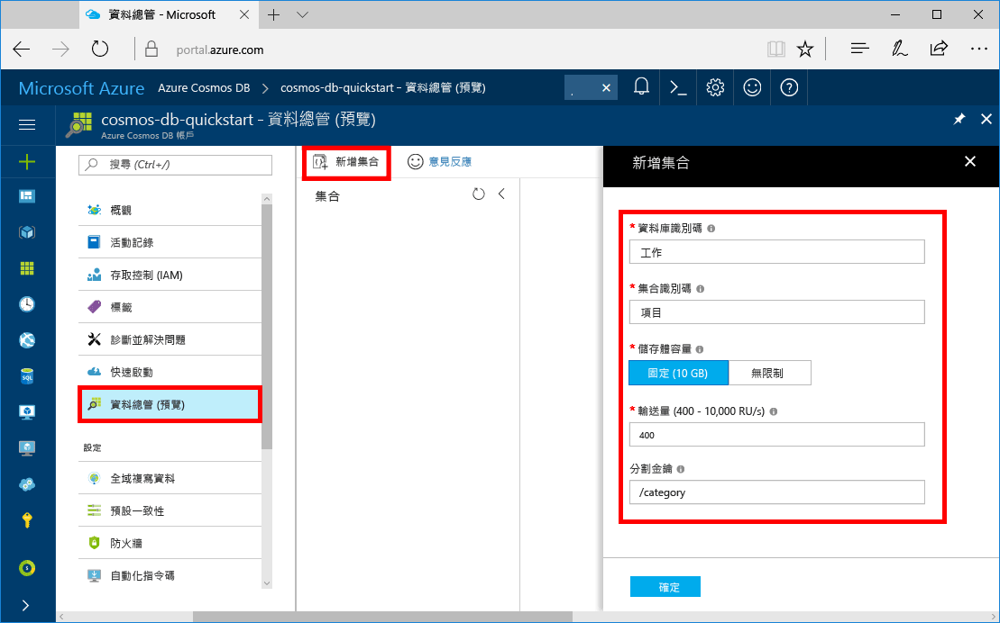

您現在可以在 Azure 入口網站中使用 [資料總管] 工具，建立資料庫和集合。 

1. 按一下 [資料總管] > [新增集合]。 
    
    [新增集合] 區域會顯示在最右邊，您可能需要向右捲動才能看到它。

    

2. 在 [新增集合] 頁面上，輸入新集合的設定。

    設定|建議的值|說明
    ---|---|---
    資料庫識別碼|工作|輸入 *Tasks* 作為新資料庫的名稱。 資料庫名稱必須包含從 1 到 255 個字元，且不能包含 /、\\、#、? 或尾端空格。
    集合識別碼|項目|輸入 *Items* 作為新集合的名稱。 集合識別碼與資料庫名稱具有相同的字元需求。
    儲存體容量| 固定 (10 GB)|使用預設值 [固定 (10 GB)]。 此值是資料庫的儲存體容量。
    Throughput|400 RU|將輸送量變更為每秒 400 個要求單位 (RU/秒)。 儲存體容量必須設為 [固定 (10 GB)]，才能將輸送量設為 400 RU/秒。 如果您想要降低延遲，稍後可以相應增加輸送量。 
    
    除了上述的設定，您可以選擇性地為集合新增 [唯一索引鍵]。 在此範例中，讓我們將欄位保留空白。 唯一索引鍵可讓開發人員在資料庫中新增一層資料完整性。 您可在建立集合時建立唯一索引鍵原則，以確保每個資料分割索引鍵一或多個值的唯一性。 若要深入了解，請參閱 [Azure Cosmos DB 中的唯一索引鍵](../articles/cosmos-db/unique-keys.md)一文。
    
    按一下 [確定]。

    [資料總管] 會顯示新的資料庫和集合。

    ![Azure 入口網站 [資料總管]，顯示新的資料庫和集合](./media/cosmos-db-create-collection/azure-cosmos-db-new-collection.png)