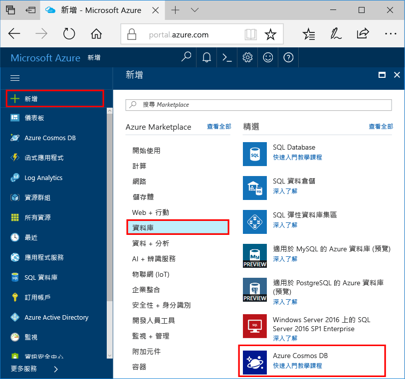
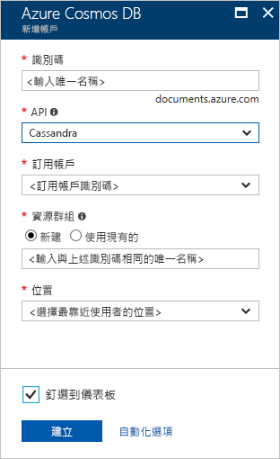

1. 在新的瀏覽器視窗中，登入 [Azure 入口網站](https://portal.azure.com/)。

2. 選取 [建立資源] > [資料庫] > [Azure Cosmos DB]。
   
   

3. 在 [新增帳戶] 頁面中，輸入新的 Azure Cosmos DB 帳戶的設定。 
 
    設定|建議的值|說明
    ---|---|---
    ID|*輸入唯一名稱*|輸入唯一名稱來識別此 Azure Cosmos DB 帳戶。 因為 *cassandra.cosmosdb.azure.com* 會附加到您所提供的識別碼以建立接觸點，請使用可供辨識的唯一識別碼。  識別碼只能包含小寫字母、數字及連字號 (-) 字元，且必須包含 3 到 50 個字元。
    API|Cassandra|API 會決定要建立的帳戶類型。 Azure Cosmos DB 會提供五個 API，以符合應用程式的需求︰SQL (文件資料庫)、Gremlin (圖形資料庫)、MongoDB (文件資料庫)、Azure 資料表及 Cassandra，目前各自需要個別的帳戶。   選取 **Cassandra**，因為在本快速入門中，您會使用 CQL 語法建立寬欄 (wide-column) 資料庫。  [深入了解 Cassandra API](../articles/cosmos-db/cassandra-introduction.md)。|
    訂用帳戶|*您的訂用帳戶*|選取您要用於此 Azure Cosmos DB 帳戶的 Azure 訂用帳戶。 
    資源群組|新建  *然後輸入上面識別碼中所提供的同一個唯一名稱*|選取 [新建]，然後為您的帳戶輸入新的資源群組名稱。 為求簡化，您可以使用和識別碼相同的名稱。 
    位置|*選取最接近使用者的區域*|選取用來主控 Azure Cosmos DB 帳戶的地理位置。 使用最接近使用者的位置，以便他們能以最快速度存取資料。
    釘選到儀表板 | 選取 | 選取此方塊，以便將新的資料庫帳戶新增至入口網站儀表板以方便存取。

    接著，按一下 [建立]。

    

4. 建立帳戶需要幾分鐘的時間。 等候入口網站顯示頁面「**恭喜!已建立您的 Azure Cosmos DB 帳戶**」。

