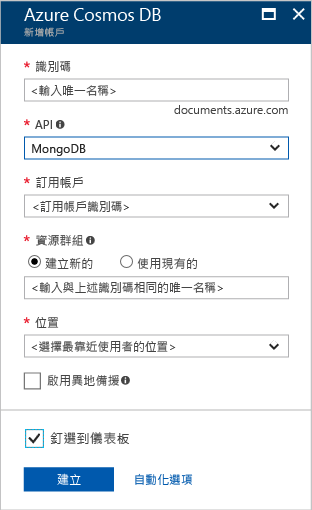

1. 在新的視窗中，登入 [Azure 入口網站](https://portal.azure.com/)。
2. 在左側功能表中，依序按一下 [建立資源]、[資料庫]，然後在 [Azure Cosmos DB] 下按一下 [建立]。
   
   ![Azure 入口網站的螢幕擷取畫面，其中反白顯示 [其他服務] 和 Azure Cosmos DB](./media/cosmos-db-create-dbaccount-mongodb/create-nosql-db-databases-json-tutorial-1.png)

3. 在 [新增帳戶] 刀鋒視窗中指定 [MongoDB] 作為 API，並填入所需的 Azure Cosmos DB 帳戶組態。
 
    * [識別碼] 必須是您要用來識別 Azure Cosmos DB 帳戶的唯一名稱。 它只能包含小寫字母、數字及 '-' 字元，且長度必須是 3 到 50 個字元。
    * [訂用帳戶] 是您的 Azure 訂用帳戶。 系統會自動加以填入。
    * [資源群組] 是您 Azure Cosmos DB 帳戶的資源群組名稱。 選取 [新建]，然後為您的帳戶輸入新的資源群組名稱。 為求簡化，您可以使用和識別碼相同的名稱。
    * [位置] 是您的 Azure Cosmos DB 帳戶所在的地理位置。 請選擇最靠近使用者的位置。

    接著，按一下 [建立]。

    

4. 建立帳戶需要幾分鐘的時間。 等候入口網站顯示 [恭喜!您的 Azure Cosmos DB 帳戶及 MongoDB API 已就緒] 頁面。

    ![Azure 入口網站的 [通知] 窗格](./media/cosmos-db-create-dbaccount-mongodb/azure-cosmos-db-account-created.png)
