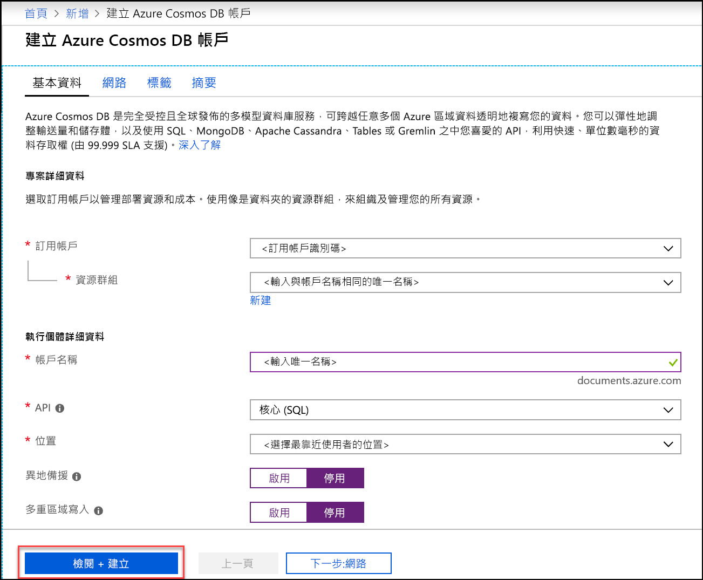
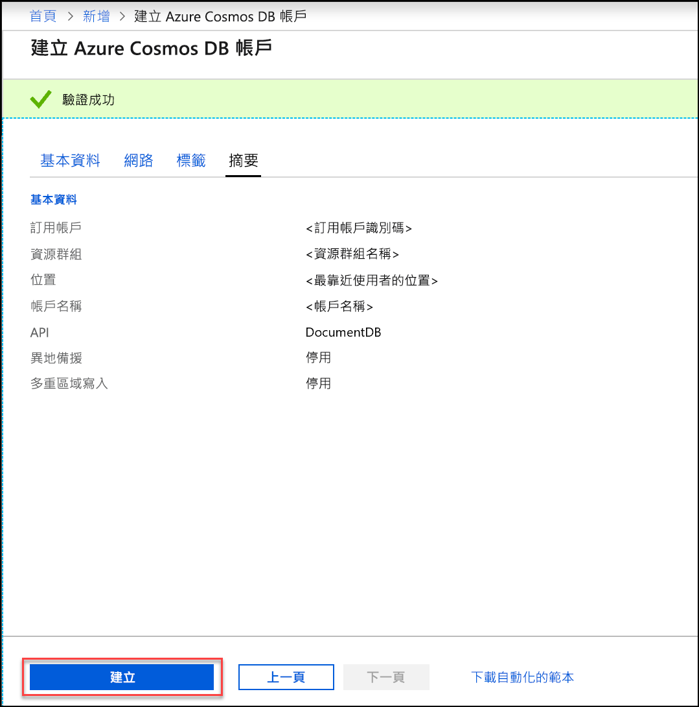
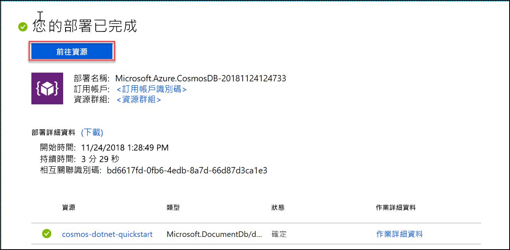

1. 在新的瀏覽器視窗中，登入 [Azure 入口網站](https://portal.azure.com/)。
2. 按一下 [建立資源] > [資料庫] > [Azure Cosmos DB]。
   
   

3. 在 [建立 Azure Cosmos DB 帳戶] 頁面中，輸入新的 Azure Cosmos DB 帳戶的設定。 
 
    設定|值|說明
    ---|---|---
    訂用帳戶|*您的訂用帳戶*|選取要用於此 Azure Cosmos DB 帳戶的 Azure 訂用帳戶。 
    資源群組|新建  *輸入唯一名稱*|選取 [新建]，然後為您的帳戶輸入新的資源群組名稱。 為求簡化，您可以使用和帳戶名稱相同的名稱。 
    帳戶名稱|*輸入唯一名稱*|輸入唯一名稱來識別您的 Azure Cosmos DB 帳戶。 因為 documents.azure.com 會附加到您所提供的識別碼以建立 URI，請使用唯一識別碼。  識別碼只能包含小寫字母、數字及連字號 (-) 字元，且字元長度必須介於 3 到 31 個字元之間。
    API|Core (SQL)|API 會決定要建立的帳戶類型。 Azure Cosmos DB 提供五個 API：SQL (文件資料庫)、Gremlin (圖形資料庫)、MongoDB (文件資料庫)、資料表 API 與 Cassandra API。 每個 API 目前都要求您建立個別帳戶。   請選取 [Core (SQL)]，因為在本文中，您將建立文件資料庫並使用 SQL 語法進行查詢。   [進一步了解 SQL API](../articles/cosmos-db/documentdb-introduction.md)|
    位置|*選取最接近使用者的區域*|選取用來裝載 Azure Cosmos DB 帳戶的地理位置。 使用最接近使用者的位置，以便他們能以最快速度存取資料。
    啟用異地備援| 保留空白 | 這會在第二個 (配對) 區域建立資料庫的複本。 將此項保留空白。  
    多重區域寫入| 保留空白 | 這可讓每個資料庫區域都成為讀取和寫入區域。 將此項保留空白。  

    然後按一下 [檢閱 + 建立]。 您可以略過 [網路] 和 [標記] 區段。 

    

    檢閱摘要資訊，然後按一下 [建立]。 

    

4. 建立帳戶需要幾分鐘的時間。 等候入口網站顯示**您的部署已完成**訊息，然後按一下 [移至資源]。     

    

5. 入口網站現在會顯示**恭喜！已建立您的 Azure Cosmos DB 帳戶** 頁面。

    ![Azure 入口網站的 [通知] 窗格](./media/cosmos-db-create-dbaccount/azure-cosmos-db-account-created.png)

