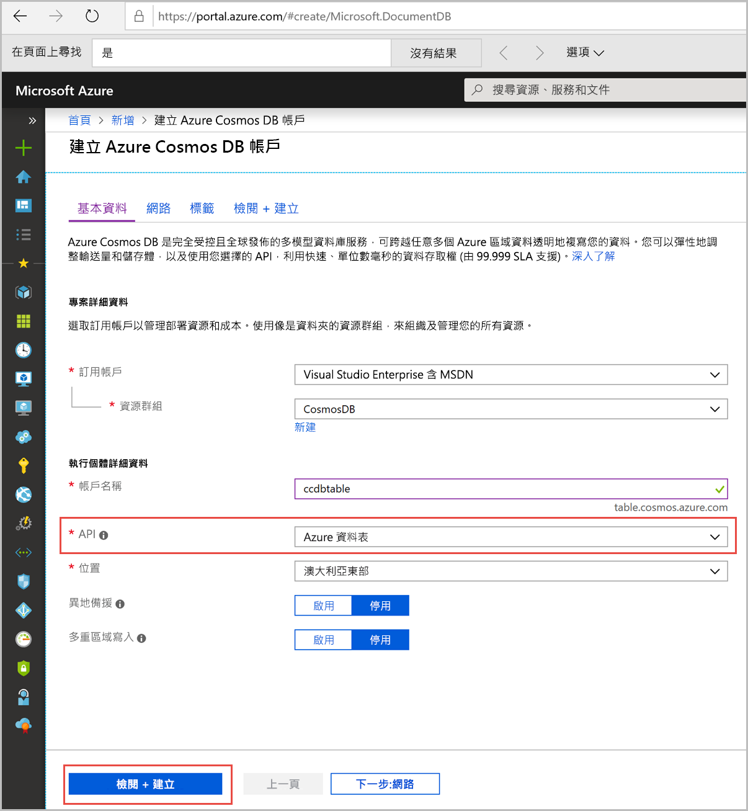

1. 在新的瀏覽器視窗中，登入 [Azure 入口網站](https://portal.azure.com/)。
2. 在左側功能表中，依序按一下 [建立資源]、[資料庫]，然後在 [Azure Cosmos DB] 下按一下 [建立]。 
   
   ![Azure 入口網站的螢幕擷取畫面，其中反白顯示 [其他服務] 和 Azure Cosmos DB](./media/cosmos-db-create-dbaccount-table/create-nosql-db-databases-json-tutorial-1.png)

3. 在 [新增帳戶] 頁面中，輸入新的 Azure Cosmos DB 帳戶的設定。 
 
    設定|建議的值|說明
    ---|---|---
    ID|*輸入唯一名稱*|輸入唯一名稱來識別此 Azure Cosmos DB 帳戶。 因為 documents.azure.com 會附加到您所提供的識別碼以建立 URI，請使用可供辨識的唯一識別碼。  識別碼只能包含小寫字母、數字及連字號 (-) 字元，且必須包含 3 到 50 個字元。
    API|Azure 資料表|API 會決定要建立的帳戶類型。 Azure Cosmos DB 會提供五個 API，以符合應用程式的需求︰SQL (文件資料庫)、Gremlin (圖形資料庫)、MongoDB (文件資料庫)、Azure 資料表及 Cassandra，目前各自需要個別的帳戶。  選取 [Azure 資料表]，因為在此本快速入門中，您會建立可搭配資料表 API 使用的資料表。  [深入了解資料表 API](../articles/cosmos-db/table-introduction.md) |
    訂用帳戶|*輸入上面識別碼中所提供的同一個唯一名稱*|選取您要用於此 Azure Cosmos DB 帳戶的 Azure 訂用帳戶。 
    資源群組|新建  *然後輸入上面識別碼中所提供的同一個唯一名稱*|選取 [新建]，然後為您的帳戶輸入新的資源群組名稱。 為求簡化，您可以使用和識別碼相同的名稱。
    位置|*選取最接近使用者的區域*|選取用來主控 Azure Cosmos DB 帳戶的地理位置。 使用最接近使用者的位置，以便他們能以最快速度存取資料。
    啟用異地備援| 保留空白 | 這會在第二個 (配對) 區域建立資料庫的複本。 將此項保留空白。  
    釘選到儀表板 | 選取 | 選取此方塊，以便將新的資料庫帳戶新增至入口網站儀表板以方便存取。

    接著，按一下 [建立]。

    

4. 建立帳戶需要幾分鐘的時間。 等候入口網站顯示 [恭喜!**已建立您的 Azure Cosmos DB 帳戶]** 頁面。

    ![Azure 入口網站的 [通知] 窗格](./media/cosmos-db-create-dbaccount-table/azure-cosmos-db-account-created.png)
