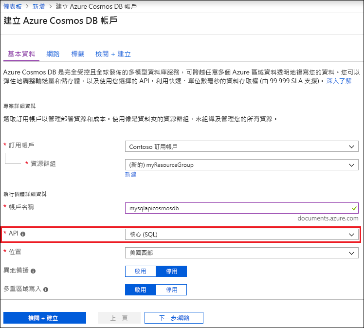
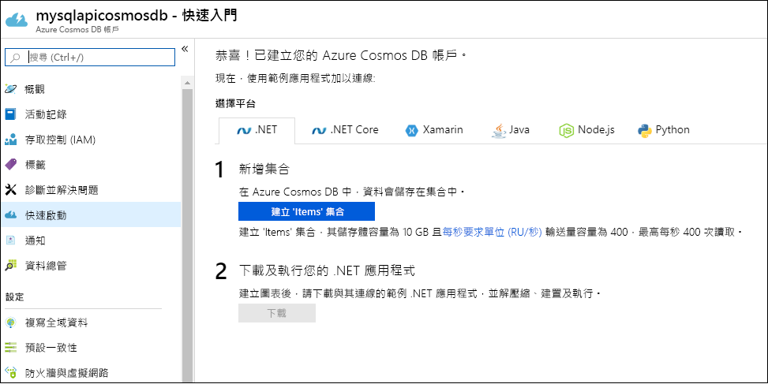

1. 登入 [Azure 入口網站](https://portal.azure.com/)。
1. 選取 [建立資源] > [資料庫] > [Azure Cosmos DB]。
   
   

1. 在 [建立 Azure Cosmos DB 帳戶] 頁面上，輸入新 Azure Cosmos 帳戶的基本設定。 
 
    |設定|值|說明 |
    |---|---|---|
    |訂用帳戶|訂用帳戶名稱|選取要用於此 Azure Cosmos 帳戶的 Azure 訂用帳戶。 |
    |資源群組|資源群組名稱|選取資源群組，或選取 [新建]，然後輸入新資源群組的唯一名稱。 |
    | 帳戶名稱|輸入唯一名稱|輸入名稱來識別您的 Azure Cosmos 帳戶。 因為 documents.azure.com 會附加到您所提供的識別碼以建立 URI，請使用唯一識別碼。  識別碼只能包含小寫字母、數字及連字號 (-) 字元。 其長度必須介於 3 到 31 個字元之間。|
    | API|Core (SQL)|API 會決定要建立的帳戶類型。 Azure Cosmos DB 提供五個 API：Core(SQL) 和 MongoDB (適用於文件資料)、Gremlin (適用於圖形資料)、Azure 資料表及 Cassandra。 目前，您必須為每個 API 建立個別個帳戶。   選取 [Core(SQL)]，以使用 SQL 語法建立文件資料庫並進行查詢。   [進一步了解 SQL API](../articles/cosmos-db/documentdb-introduction.md)。|
    | 位置|選取最接近使用者的區域|選取用來裝載 Azure Cosmos DB 帳戶的地理位置。 使用最接近使用者的位置，讓他們能以最快速度存取資料。|
   
   

1. 選取 [檢閱 + 建立]。 您可以略過 [網路] 和 [標記] 區段。 

1. 檢閱帳戶設定，然後選取 [建立]。 建立帳戶需要幾分鐘的時間。 等候入口網站頁面顯示 [您的部署已完成] 訊息。 

    ![Azure 入口網站的 [通知] 窗格](./media/cosmos-db-create-dbaccount/azure-cosmos-db-account-created.png)

1. 選取 [移至資源] 以移至 Azure Cosmos DB 帳戶頁面。 

    
