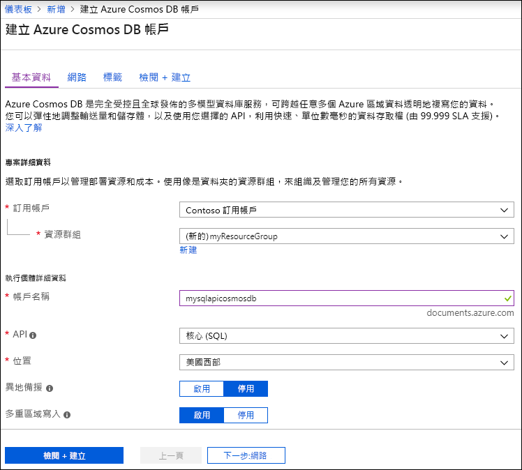

1. 移至 [Azure 入口網站](https://portal.azure.com/)來建立 Azure Cosmos DB 帳戶。 搜尋並選取 [Azure Cosmos DB]  。

   

1. 選取 [新增]  。
1. 在 [建立 Azure Cosmos DB 帳戶]  頁面上，輸入新 Azure Cosmos 帳戶的基本設定。 

    |設定|值|描述 |
    |---|---|---|
    |訂用帳戶|訂閱名稱|選取要用於此 Azure Cosmos 帳戶的 Azure 訂用帳戶。 |
    |資源群組|資源群組名稱|選取資源群組，或選取 [新建]  ，然後輸入新資源群組的唯一名稱。 |
    |帳戶名稱|唯一的名稱|輸入名稱來識別您的 Azure Cosmos 帳戶。 因為 documents.azure.com  會附加到您所提供的名稱以建立 URI，請使用唯一名稱。  名稱只能包含小寫字母、數字及連字號 (-) 字元。 其長度必須介於 3 到 31 個字元之間。|
    |API|要建立的帳戶類型|選取 [Core(SQL)]  ，以使用 SQL 語法建立文件資料庫並進行查詢。   API 會決定要建立的帳戶類型。 Azure Cosmos DB 提供五個 API：Core(SQL) 和 MongoDB (適用於文件資料)、Gremlin (適用於圖形資料)、Azure 資料表及 Cassandra。 目前，您必須為每個 API 建立個別個帳戶。   [進一步了解 SQL API](../articles/cosmos-db/documentdb-introduction.md)。|
    |Location|最接近使用者的區域|選取用來裝載 Azure Cosmos DB 帳戶的地理位置。 使用最接近使用者的位置，讓他們能以最快速度存取資料。|

   

1. 選取 [檢閱 + 建立]  。 您可以略過 [網路]  和 [標記]  區段。

1. 檢閱帳戶設定，然後選取 [建立]  。 建立帳戶需要幾分鐘的時間。 等候入口網站頁面顯示 [您的部署已完成]  訊息。 

    ![Azure 入口網站的 [通知] 窗格](./media/cosmos-db-create-dbaccount/azure-cosmos-db-account-created.png)

1. 選取 [移至資源]  以移至 Azure Cosmos DB 帳戶頁面。 

    
