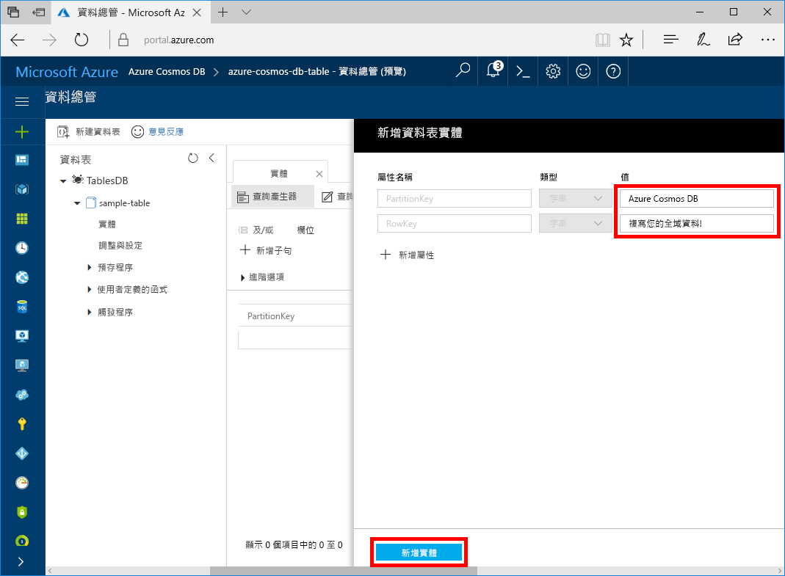

您現在可以使用資料總管將資料新增至您的新資料表。

1. 在資料總管中，展開 **sample-table**，選取 [實體]  ，然後選取 [新增實體]  。

   ![在 Azure 入口網站的 [資料總管] 中建立新實體](./media/cosmos-db-create-table-add-sample-data/azure-cosmosdb-data-explorer-new-document.png)

2. 現在，將資料新增至 PartitionKey 值方塊和 RowKey 值方塊，然後選取 [新增實體]  。

   
  
    您現在可以在資料表中新增更多實體、編輯實體，或在資料總管中查詢資料。 資料總管也可供您縮放輸送量，以及對資料表新增預存程序、使用者定義函式和觸發程序。