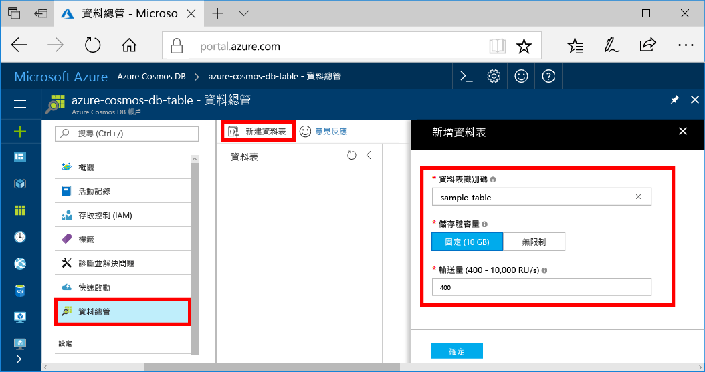

您現在可以在 Azure 入口網站中使用 [資料總管] 工具，建立資料庫和資料表。 

1. 選取 [資料總管]   > [新增資料表]  。 
    
    [新增資料表]  區域會顯示在最右邊，您可能需要向右捲動才會看到。

    

2. 在 [新增資料表]  頁面中，輸入新資料表的設定。

    設定|建議的值|說明
    ---|---|---
    資料表識別碼|sample-table|新資料表的識別碼。 資料表名稱與資料庫識別碼具有相同的字元需求。 資料庫名稱的長度必須介於 1 到 255 個字元，且不能包含 `/ \ # ?` 或尾端空格。
    Throughput|400 RU|將輸送量變更為每秒 400 個要求單位 (RU/秒)。 如果您想要降低延遲，稍後可以相應增加輸送量。

3. 選取 [確定]  。

4. [資料總管] 會顯示新的資料庫和資料表。

   ![Azure 入口網站 [資料總管]，顯示新的資料庫和集合](./media/cosmos-db-create-table/azure-cosmos-db-new-table.png)