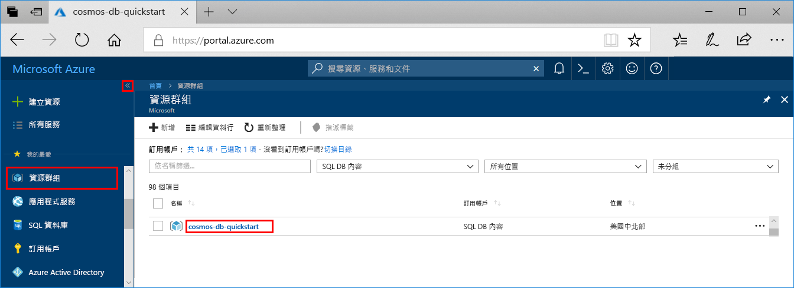
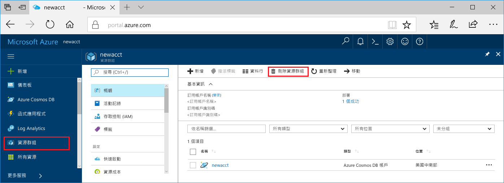

完成您的 Web 應用程式和 Azure Cosmos DB 帳戶之後，您可以將建立的 Azure 資源刪除，以免產生更多費用。 若要刪除資源：

1. 在 Azure 入口網站中，選取最左邊的 [資源群組]  。 若已摺疊左側功能表，請選取加以展開。

2. 選取您在本快速入門中建立的資源群組。  

   

2. 在新視窗中，選取 [刪除資源群組]  。

      

3. 在下個視窗中輸入要刪除的資源群組名稱，然後選取 [刪除]  。

