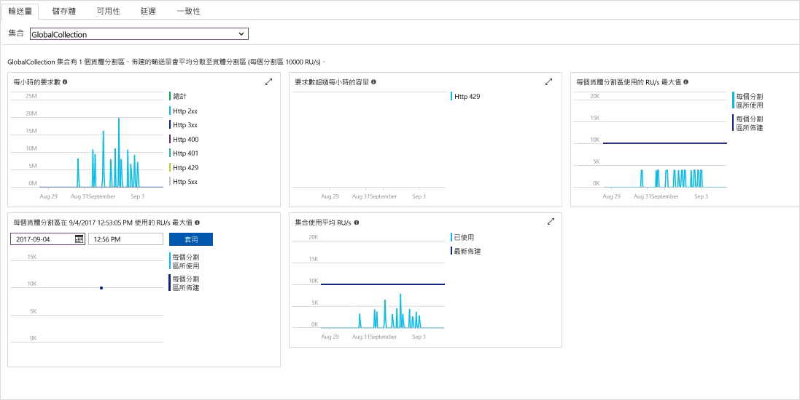

Azure 入口網站會監視您的 Cosmos DB 帳戶輸送量、儲存體、可用性、延遲和一致性。 與 [Azure Cosmos DB 服務等級協定 (SLA)](https://azure.microsoft.com/support/legal/sla/cosmos-db/) 相關聯的計量圖表會顯示相較於實際效能的 SLA 值。 此計量套件可讓您以更透明的方式監視監視 SLA。

若要檢閱計量和 SLA： 

1. 在您的 Cosmos DB 帳戶導覽功能表中，選取 [計量]  。
   
2. 選取一個索引標籤 (例如 [延遲]  )，並在右側選取時間範圍。 比較圖表中的**實際**和 **SLA** 的資料行。
   
   
   
3. 檢閱其他索引標籤中的計量。 

