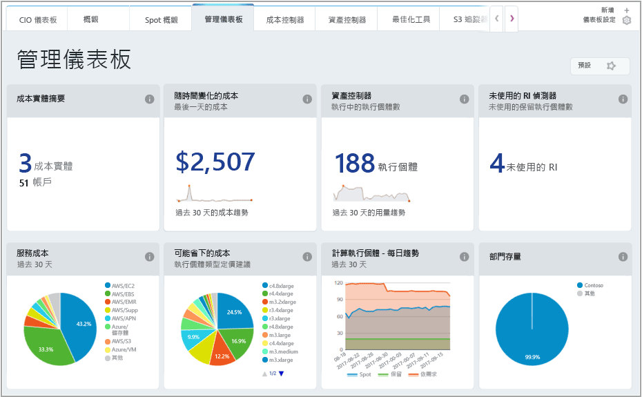
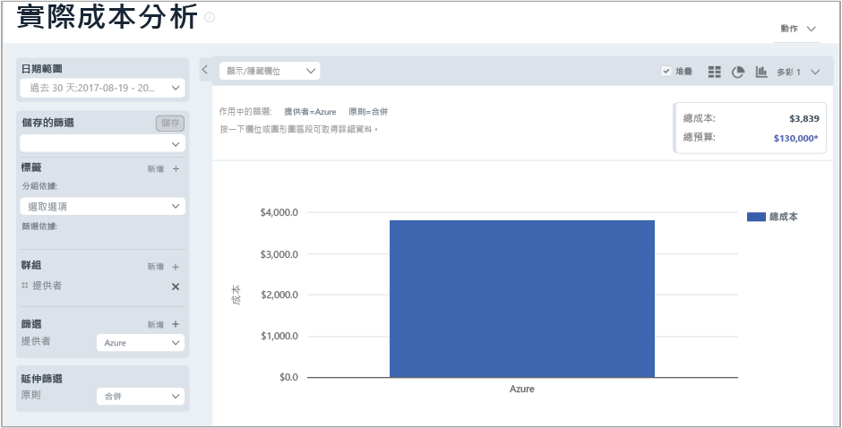
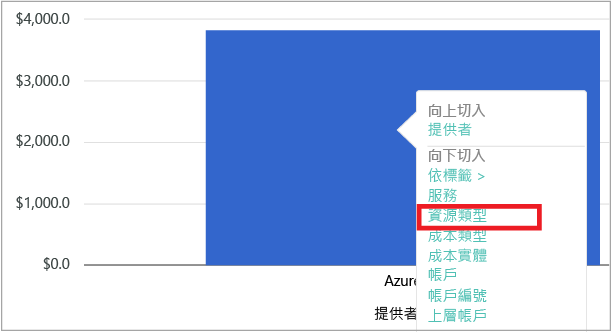
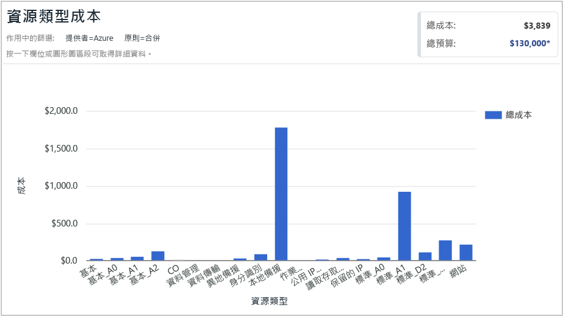
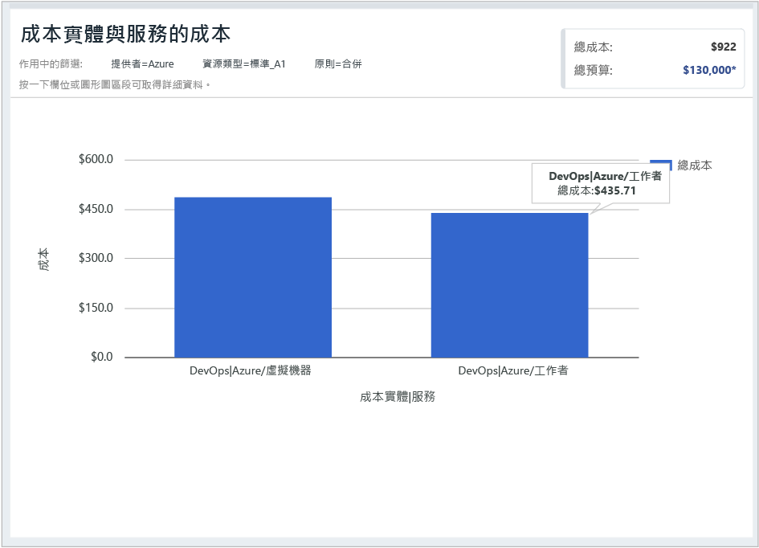

## 檢視成本資料

Cloudyn 的 Azure 成本管理可讓您存取您的所有雲端資源資料。 您可以從儀表板的報告中找到以索引標籤式檢視呈現的標準和自訂報告。 以下是可立即向您顯示成本資料的常見儀表板和報告範例。

在此範例中，管理儀表板會顯示 Contoso 公司在其所有雲端資源的合併成本。 Contoso 使用 Azure、AWS 和 Google。 儀表板會提供快速總覽資訊，並可讓您快速瀏覽至報告。  

如果您不確定儀表板報告的用途，請將滑鼠停留在**i** 符號上，即可看見說明。 按一下儀表板中的任何報告，就能檢視完整的報告。

您也可以使用入口網站頂端的 [報告] 功能表來檢視報告。 讓我們看看 Contoso 在過去 30 天的 Azure 資源消費情形。 按一下 [成本] > [成本分析] > [實際成本分析]。 如果您的報告中設定了任何標籤、群組或篩選器的值，請清除這些值。

在此範例中，總成本是 122,273美元，預算是 290,000 美元。

現在，讓我們修改報告格式，並設定群組和篩選器來縮小 Azure 成本的結果。 將 [日期範圍] 設定為過去 30 天。 在右上方按一下要格式化為長條圖的資料行符號，並在 [群組] 下選取 [提供者]。 然後，將 [提供者] 的篩選器設定為 [Azure]。

在此範例中，過去 30 天 Azure 資源的總成本是 3,309 美元。

以滑鼠右鍵按一下 [提供者] \(Azure) 長條，並向下鑽研至 [資源類型]。

下圖顯示 Contoso 所產生的 Azure 資源成本。 總計為 3,309 美元。 在此範例中，大約一半的成本是用在 Standard_A1 虛擬機器，另一半成本則是用在各種 Azure 服務和虛擬機器執行個體。

以滑鼠右鍵按一下 [資源類型]，然後選取 [成本實體] 來檢視取用資源的成本實體和服務。 在下列範例影像中，本地備援儲存體設定為「資源」類型。 Contoso|Azure/Storage 取用 $15.65。 Engineering|Azure Storage 取用 $164.25。 Shared Infrastructure|Azure/Storage 取用 $116.58。 服務總成本為 $296。

若要觀看有關雲端計費資料的教學指導影片，請參閱[使用 Cloudyn 的 Azure 成本管理分析您的雲端計費資料](https://youtu.be/G0pvI3iLH-Y)。
