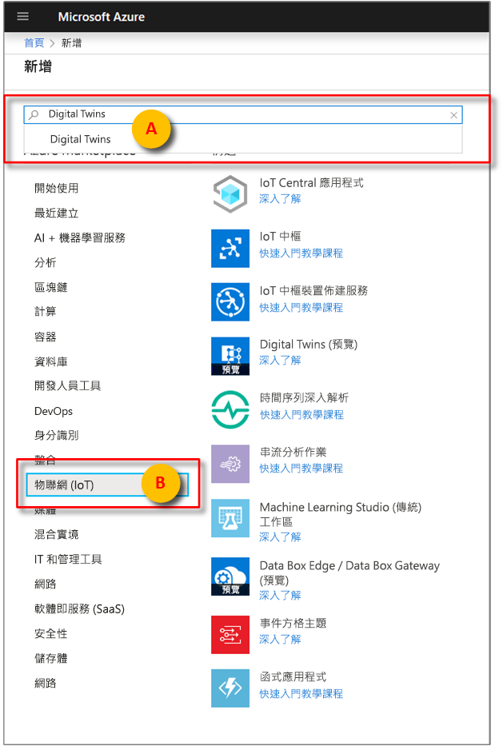
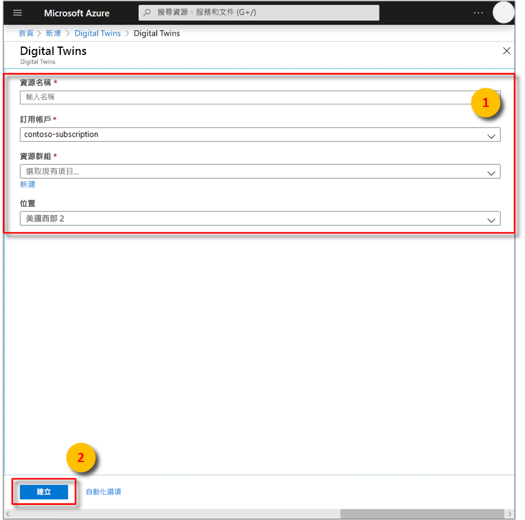
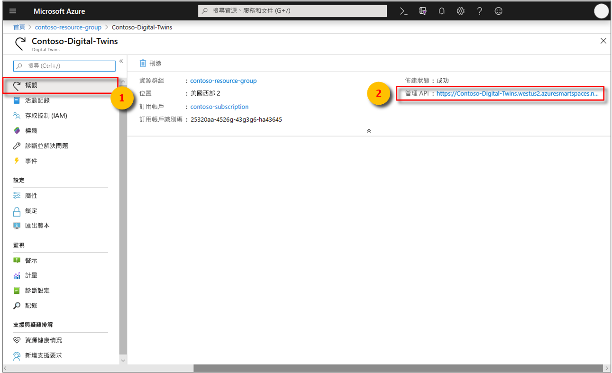

1. 登入 [Azure 入口網站](http://portal.azure.com)。

1. 從左側導覽窗格按一下 [建立資源]。 搜尋「Digital Twins」，然後選取 [Digital Twins (預覽)]。 按一下 [建立]  以啟動部署程序。

    

1. 在 [Digital Twins] 窗格中，輸入下列資訊：
   * **資源名稱**：為 Digital Twins 執行個體建立獨一無二的名稱。
   * **訂用帳戶**：選擇您要用來建立此 Digital Twins 執行個體的訂用帳戶。 
   * **資源群組**：選取或建立 Digital Twins 執行個體的[資源群組](https://docs.microsoft.com/azure/azure-resource-manager/resource-group-overview#resource-groups)。
   * **位置**：選取最接近裝置的位置。

    

1. 檢閱 Digital Twins 資訊，然後按一下 [建立]。 Digital Twins 執行個體可能需要幾分鐘的時間才會建立好。 您可以在 [通知] 窗格中監視進度。

1. 開啟 Digital Twins 執行個體的 [概觀] 窗格。 請記下顯示於 [管理 API] 下方的連結。

    1. **管理 API** URL 的格式為：**https://yourDigitalTwinsName.yourLocation.azuresmartspaces.net/management/swagger**。 此 URL 會帶您前往您的執行個體所適用的 Azure Digital Twins REST API 文件。 請閱讀[如何使用 Azure Digital Twins Swagger](../articles/digital-twins/how-to-use-swagger.md)，以了解如何閱讀及使用此 API 文件。

    1. 將**管理 API** URL 修改為此格式：**https://yourDigitalTwinsName.yourLocation.azuresmartspaces.net/management/api/v1.0/**。 應用程式會使用修改後的 URL 作為基底 URL 來存取執行個體。 將這個修改後的 URL 複製到暫存檔。 下一節會用到此 URL。

    