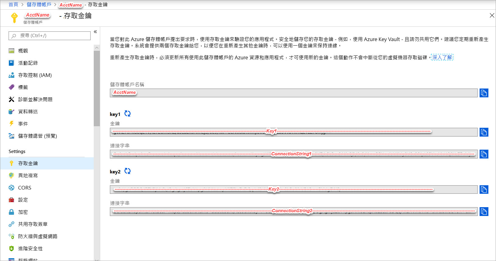
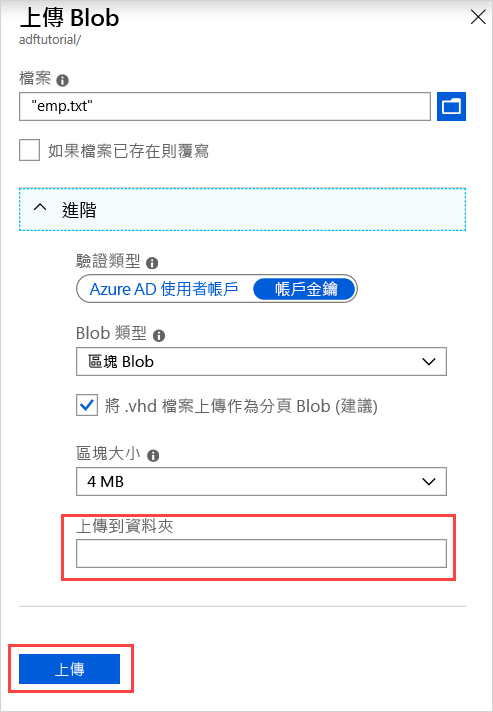

## <a name="prerequisites"></a>必要條件

### <a name="azure-subscription"></a>Azure 訂用帳戶
如果您沒有 Azure 訂用帳戶，請在開始前建立 [免費帳戶](https://azure.microsoft.com/free/) 。

### <a name="azure-roles"></a>Azure 角色
若要建立 Data Factory 執行個體，您用來登入 Azure 的使用者帳戶必須為「參與者」或「擁有者」角色，或是 Azure 訂用帳戶的「管理員」。 若要檢視您在訂用帳戶中擁有的權限，請在 Azure 入口網站中選取右上角的使用者名稱，然後選取 [權限]。 如果您有多個訂用帳戶的存取權，請選取適當的訂用帳戶。 

若要建立及管理 Data factory 的子資源 (包括資料集、連結服務、管線、觸發程序和整合執行階段)，必須要符合下列需求：
- 若要在 Azure 入口網站中建立及管理子資源，您必須屬於資源群組層級或更高層級的 **Data Factory 參與者**角色。
- 若要使用 PowerShell 或 SDK 來建立及管理子資源，具備資源層級或更高層級的**參與者**角色即已足夠。

如需將使用者新增至角色的範例指示，請參閱[新增角色](../articles/billing/billing-add-change-azure-subscription-administrator.md)一文。

如需詳細資訊，請參閱下列文章：
- [Data Factory 參與者角色](../articles/role-based-access-control/built-in-roles.md#data-factory-contributor)
- [Azure Data Factory 的角色和權限](../articles/data-factory/concepts-roles-permissions.md)

### <a name="azure-storage-account"></a>Azure 儲存體帳戶
您可以使用一般用途的 Azure 儲存體帳戶 (特別是 Blob 儲存體) 作為本教學課程中的「來源」和「目的地」資料存放區。 如果您沒有一般用途的 Azure 儲存體帳戶，請參閱[建立儲存體帳戶](../articles/storage/common/storage-quickstart-create-account.md)來建立帳戶。 

#### <a name="get-the-storage-account-name-and-account-key"></a>取得儲存體帳戶名稱和帳戶金鑰
您在此快速入門中將需要使用 Azure 儲存體帳戶的名稱和金鑰。 下列程序提供可取得儲存體帳戶名稱和金鑰的步驟： 

1. 在網頁瀏覽器中，移至 [Azure 入口網站](https://portal.azure.com)。 使用您的 Azure 使用者名稱和密碼登入。 
2. 選取左側功能表上的 [所有服務]，使用 **Storage** 關鍵字進行篩選，然後選取 [儲存體帳戶]。

   
3. 在儲存體帳戶清單中，篩選您的儲存體帳戶 (如有需要)，然後選取您的儲存體帳戶。 
4. 在 [儲存體帳戶] 頁面上，選取功能表上的 [存取金鑰]。

   
5. 將 [儲存體帳戶名稱] 和 [金鑰1] 方塊的值複製到剪貼簿。 將它們貼到 [記事本] 或任何其他編輯器中並加以儲存。 您稍後會在此快速入門中用到。   

#### <a name="create-the-input-folder-and-files"></a>建立輸入資料夾和檔案
在這一節中，您會在 Azure Blob 儲存體中建立一個名為 **adftutorial** 的 Blob 容器。 您會在容器中建立名為 **input** 的資料夾，然後將範例檔案上傳到 input 資料夾。 

1. 在 [儲存體帳戶] 頁面上，切換至 [概觀]，然後選取 [Blob]。 

   
2. 在 [Blob 服務] 頁面上，選取工具列上的 [+ 容器]。 

       
3. 在 [新增容器] 對話方塊中，輸入 **adftutorial** 作為名稱，然後選取 [確定]。 

   
4. 在容器清單中選取 [adftutorial]。 

   
5. 在 [容器] 頁面上，選取工具列上的 [上傳]。  

   
6. 在 [上傳 blob] 頁面上，選取 [進階]。

   
7. 啟動 [記事本] 並使用下列內容建立名為 **emp.txt** 的檔案。 將該檔案儲存在 **c:\ADFv2QuickStartPSH** 資料夾中。 建立 **ADFv2QuickStartPSH** 資料夾 (如果尚未存在)。
    
   ```
   John, Doe
   Jane, Doe
   ```    
8. 在 Azure 入口網站的 [上傳 blob] 頁面上，針對 [檔案] 方塊瀏覽並選取 **emp.txt** 檔。 
9. 輸入 **input** 作為 [上傳到資料夾] 方塊的值。 

        
10. 確認資料夾是 **input**，且檔案是 **emp.txt**，然後選取 [上傳]。
    
    您應該會在清單中看到 **emp.txt** 檔案以及上傳的狀態。 
12. 按一下角落的 [X] 關閉 [上傳 blob] 頁面。 

    
1. 將 [容器] 頁面保持開啟。 您可以在本快速入門結尾處使用它來確認輸出。