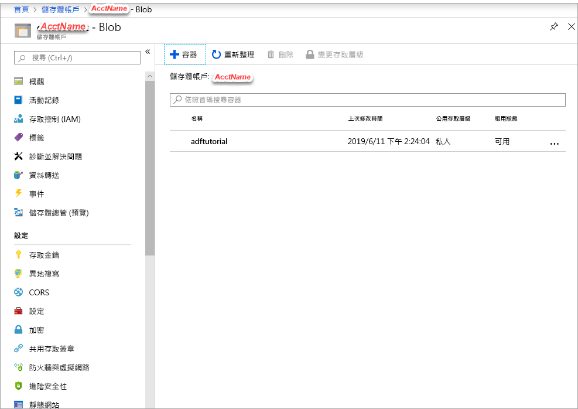

## <a name="prerequisites"></a>必要條件

### <a name="azure-subscription"></a>Azure 訂用帳戶
如果您沒有 Azure 訂用帳戶，請在開始前先建立一個[免費帳戶](https://azure.microsoft.com/free/)。

### <a name="azure-roles"></a>Azure 角色
若要建立 Data Factory 執行個體，您用來登入 Azure 的使用者帳戶必須為「參與者」  或「擁有者」  角色，或是 Azure 訂用帳戶的「管理員」  。 若要檢視您在訂用帳戶中擁有的權限，請在 **Azure 入口網站**中選取右上角的使用者名稱、選取 [更多選項]  (...)，然後選取 [我的權限](https://portal.azure.com)。 如果您有多個訂用帳戶的存取權，請選取適當的訂用帳戶。

若要建立及管理 Data factory 的子資源 (包括資料集、連結服務、管線、觸發程序和整合執行階段)，必須要符合下列需求：

- 若要在 Azure 入口網站中建立及管理子資源，您必須屬於資源群組層級或更高層級的 **Data Factory 參與者**角色。
- 若要使用 PowerShell 或 SDK 來建立及管理子資源，具備資源層級或更高層級的**參與者**角色即已足夠。

如需將使用者新增至角色的範例指示，請參閱[新增角色](../articles/billing/billing-add-change-azure-subscription-administrator.md)一文。

如需詳細資訊，請參閱下列文章：

- [Data Factory 參與者角色](../articles/role-based-access-control/built-in-roles.md#data-factory-contributor)
- [Azure Data Factory 的角色和權限](../articles/data-factory/concepts-roles-permissions.md)

### <a name="azure-storage-account"></a>Azure 儲存體帳戶
您可以使用一般用途的 Azure 儲存體帳戶 (特別是 Blob 儲存體) 作為本教學課程中的「來源」  和「目的地」  資料存放區。 如果您沒有一般用途的 Azure 儲存體帳戶，請參閱[建立儲存體帳戶](../articles/storage/common/storage-quickstart-create-account.md)來建立帳戶。 

#### <a name="get-the-storage-account-name"></a>取得儲存體帳戶名稱
您在此快速入門中將需要使用 Azure 儲存體帳戶的名稱。 下列程序提供可取得儲存體帳戶名稱的步驟： 

1. 在網頁瀏覽器中，移至 [Azure 入口網站](https://portal.azure.com)，然後使用您的 Azure 使用者名稱與密碼登入。
2. 選取 [所有服務]   > [儲存體]   > [儲存體帳戶]  。
3. 在 [儲存體帳戶]  頁面中，篩選您的儲存體帳戶 (如有需要)，然後選取您的儲存體帳戶。 

#### <a name="create-a-blob-container"></a>建立 Blob 容器
在這一節中，您會在 Azure Blob 儲存體中建立一個名為 **adftutorial** 的 Blob 容器。

1. 從 [儲存體帳戶] 頁面中，選取 [概觀]   > [Blob]  。
2. 在 [ *\<帳戶名稱>*  - Blob]  頁面的工具列上，選取 [容器]  。
3. 在 [新增容器]  對話方塊中，輸入 **adftutorial** 作為名稱，然後選取 [確定]  。 [ *\<帳戶名稱>*  - Blob]  頁面已更新，以便在容器清單中包含 **adftutorial**。

   

#### <a name="add-an-input-folder-and-file-for-the-blob-container"></a>新增 Blob 容器的輸入資料夾與檔案
在此節中，您會在您剛剛建立的容器中建立名為 **input** 的資料夾，然後將範例檔案上傳到 input 資料夾。 在您開始之前，請開啟文字編輯器 (例如 [記事本]  ) 並使用下列內容建立名為 **emp.txt** 的檔案：

```emp.txt
John, Doe
Jane, Doe
```

將該檔案儲存在 **C:\ADFv2QuickStartPSH** 資料夾中。 (如果該資料夾不存在，請予以建立。)然後返回 Azure 入口網站並依照下列步驟執行：

1. 在您離開的 [ *\<帳戶名稱>*  - Blob]  頁面中，從更新的容器清單選取 [adftutorial]  。 (如果您關閉了視窗或進入另一個頁面，請重新登入 [Azure 入口網站](https://portal.azure.com)、選取[所有服務]   > [儲存體]   > [儲存體帳戶]  ，選取您的儲存體帳戶，然後選取 [Blob]   > [adftutorial]  。)
2. 在 [adftutorial]  容器頁面的工具列上，選取 [上傳]  。
3. 在 [上傳 Blob]  頁面上，選取 [檔案]  方塊，然後瀏覽並選取 **emp.txt** 檔。
4. 展開 [進階]  標題。 現在會顯示該頁面，如下所示：

   
5. 在 [上傳至資料夾]  方塊中，輸入 **input**。
6. 選取 [上傳]  按鈕。 您應該會在清單中看到 **emp.txt** 檔案以及上傳的狀態。
7. 選取 [關閉]  圖示 (**X**) 以關閉 [上傳 Blob]  頁面。

保持 [adftutorial]  容器頁面開啟。 您可以在本快速入門結尾處使用它來確認輸出。