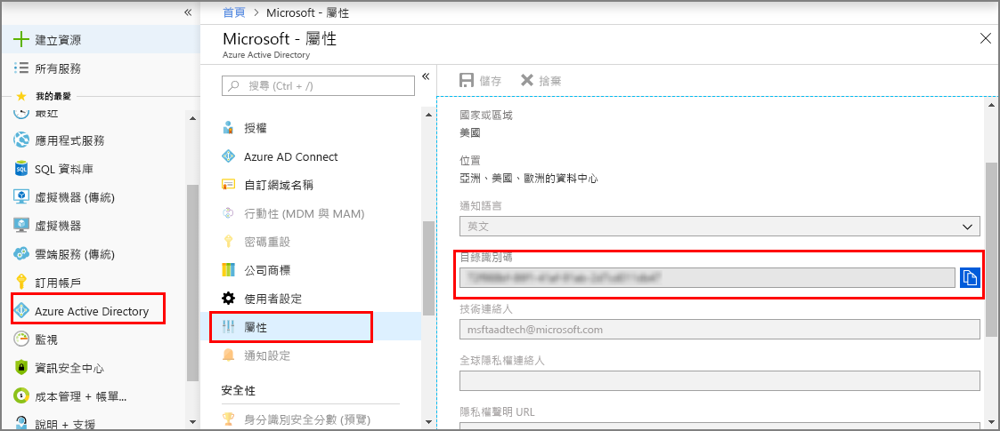
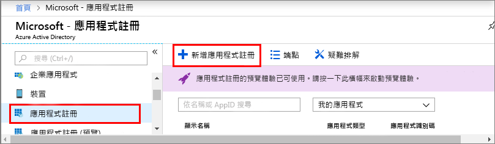
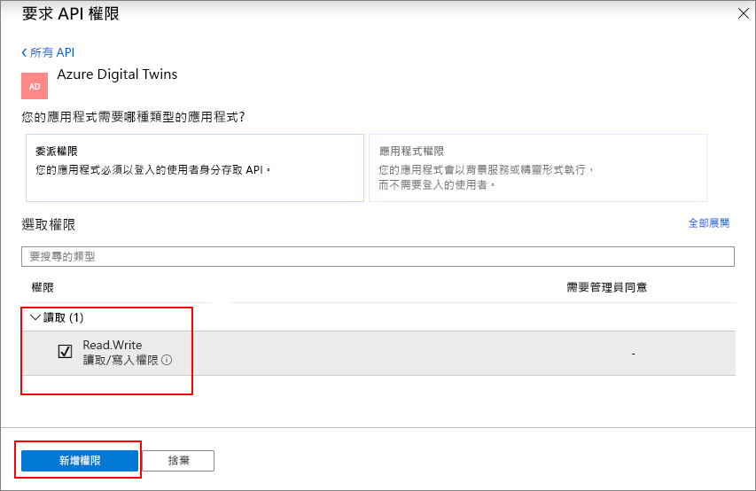

1. 在 [Azure 入口網站](https://portal.azure.com)中，從左側導覽窗格開啟 **Azure Active Directory**，然後開啟 [屬性] 窗格。 將 [目錄識別碼] 複製到暫存檔。 您會使用此值來設定下一節的應用程式範例。

    

1. 開啟 [應用程式註冊] 窗格，然後按一下 [新增應用程式註冊] 按鈕。
    
    

1. 在 [名稱] 欄位中為此應用程式註冊提供易記的名稱。 將 [應用程式類型] 選擇為 [原生]，然後將 [重新導向 URI] 選擇為 **https://microsoft.com**。 按一下頁面底部的 [新增] 。

    

1. 開啟已註冊的應用程式，並將 [應用程式識別碼] 欄位的值複製到暫存檔；這個值可識別 Azure Active Directory 應用程式。 您會使用應用程式識別碼來設定後續章節的應用程式範例。

    

1. 開啟 [應用程式註冊] 窗格，然後按一下 [設定] > [所需的權限]：
    - 按一下左上方的 [新增] 來開啟 [新增 API 存取權] 窗格。
    - 按一下 [選取 API]，並搜尋 **Azure Digital Twins**。 如果搜尋沒有找到 API，請改為搜尋 **Azure 智慧空間**。
    - 選取 Azure Digital Twins (Azure 智慧空間服務) 選項，然後按一下 選取。
    - 按一下 [選取權限]。 檢查 [讀取/寫入權限] 委派權限方塊，然後按一下 [選取]。
    - 在 [新增 API 存取權] 窗格中，按一下 [完成]。
    - 在 [所需的權限] 窗格中，按一下 [授與權限] 按鈕，然後接受所出現的通知。

       
