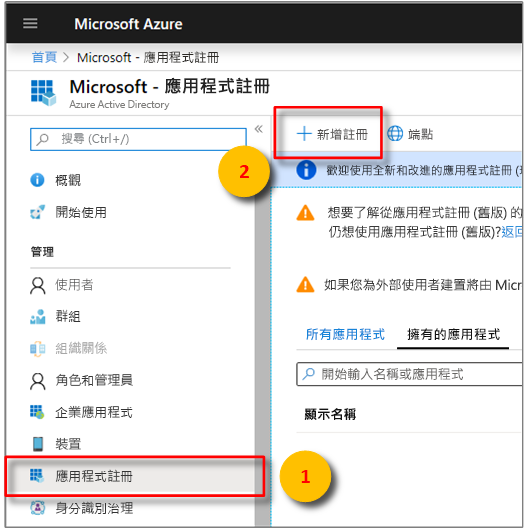
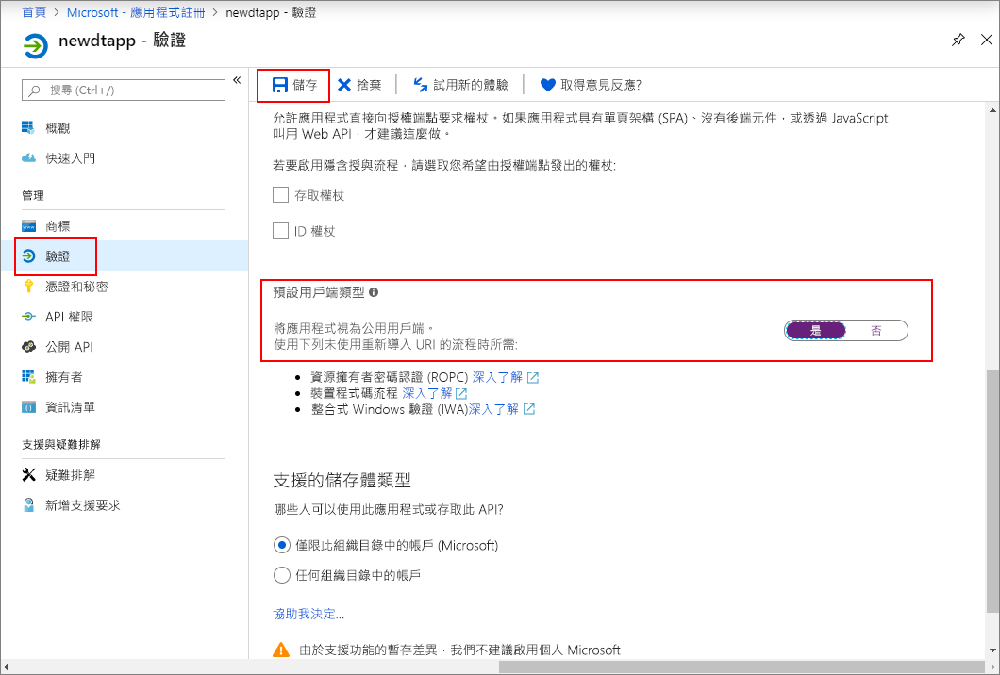
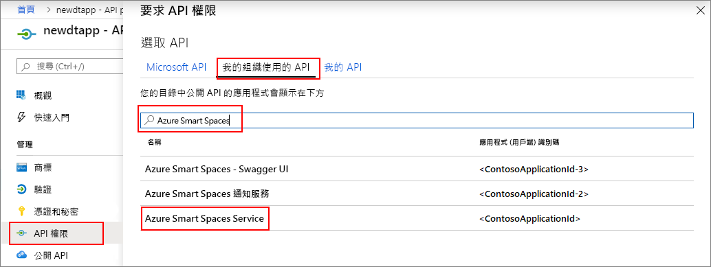
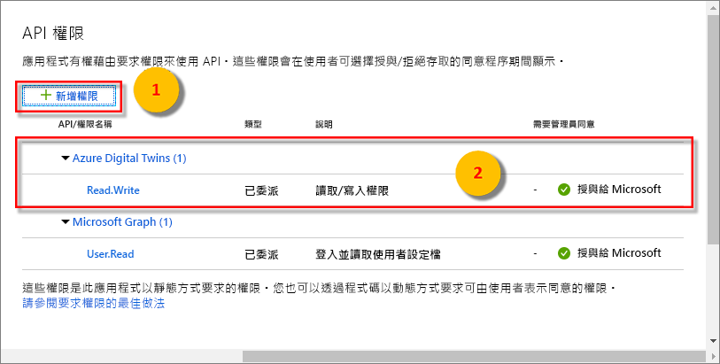

>[!NOTE]
>本節提供[新增 Azure AD 應用程式註冊](https://docs.microsoft.com/azure/active-directory/develop/quickstart-register-app)的指示。 如果您仍有舊版的原生應用程式註冊，只要受支援，您即可使用。 此外，如果新的應用程式註冊方法在您的設定中因故無法，您可以嘗試建立舊版的原生 AAD 應用程式。 如需詳細指示，請參閱[使用舊版 Azure Active Directory 註冊 Azure Digital Twins 應用程式](../articles/digital-twins/how-to-use-legacy-aad.md)。 

1. 在 [Azure 入口網站](https://portal.azure.com)中，從左側窗格開啟 **Azure Active Directory**，然後開啟 [應用程式註冊]  窗格。 選取 [新增註冊]  按鈕。

    

1. 在 [名稱]  方塊中為此應用程式註冊提供易記的名稱。 在 [重新導向 URI (選擇性)]  區段下方，選擇左側下拉式清單中的 [公用用戶端 (行動和桌面)]  ，然後在右側的文字方塊中輸入 `https://microsoft.com`。 選取 [註冊]  。

    

1. 若要確定[應用程式註冊為*原生應用程式*](https://docs.microsoft.com/azure/active-directory/develop/scenario-desktop-app-registration)，請開啟應用程式註冊的 [驗證]  窗格，並在該窗格中向下捲動。 在 [預設用戶端類型]  區段中，針對 [將應用程式視為公用用戶端]  選擇 [是]  。 

    

1.  開啟已註冊應用程式的 [概觀]  窗格，並將下列實體的值複製到暫存檔。 您會使用這些值來設定後續章節的應用程式範例。

    - **應用程式 (用戶端) 識別碼**
    - **目錄 (租用戶) 識別碼**

    

1. 開啟應用程式註冊的 [API 權限]  窗格。 選取 [新增權限]  按鈕。 在 [要求 API 權限]  窗格中選取 [我的組織使用的 API]  索引標籤，然後搜尋 [Azure 智慧空間]  。 選取 [Azure 智慧空間服務]  API。

    

1. 選取的 API 會在相同的 [要求 API 權限]  窗格中顯示為 **Azure Digital Twins**。 選取 [讀取 (1)]  下拉式清單，然後選取 [Read.Write]  核取方塊。 選取 [新增權限]  按鈕。

    

1. 根據您組織的設定，您可能需要執行其他步驟，授與對此 API 的系統管理員存取權。 請連絡系統管理員以取得詳細資訊。 管理員存取權一經核准，您 API 的 [API 權限]  窗格中的 [需要管理員同意]  資料行就會顯示如下：

    

