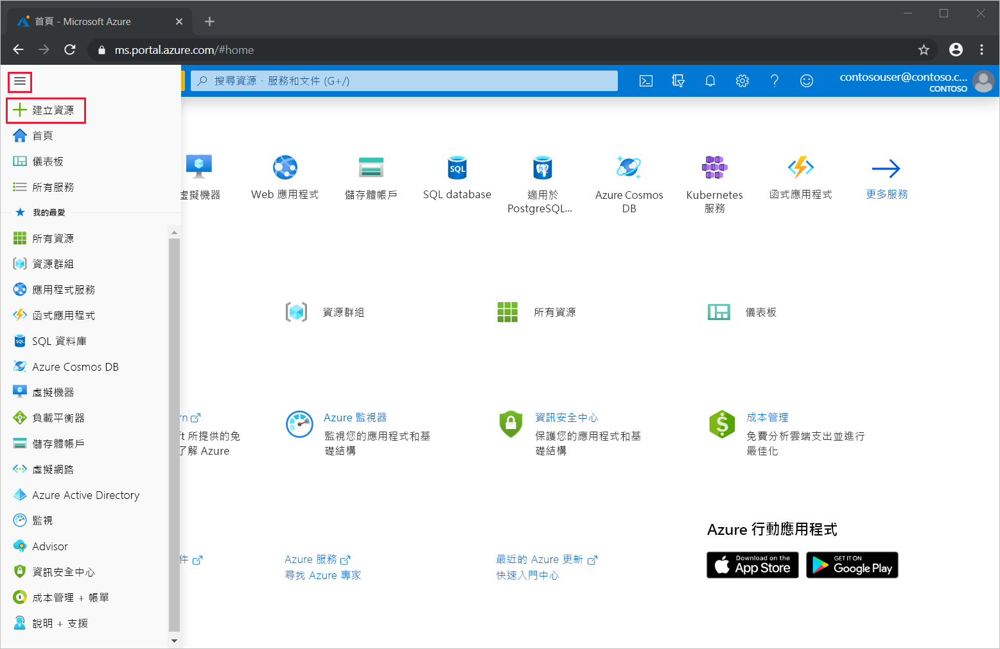
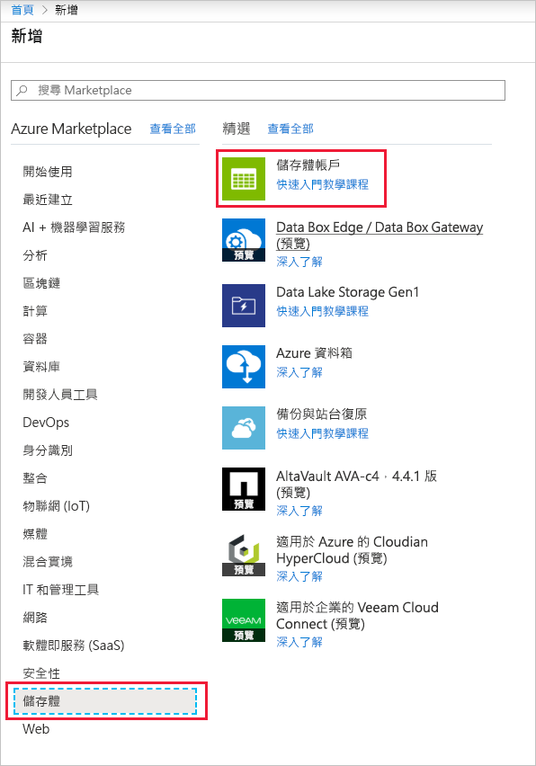
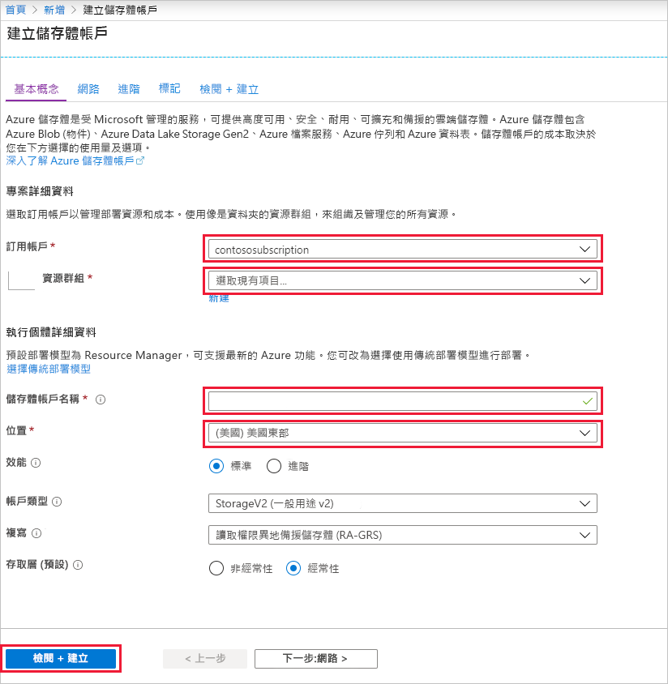
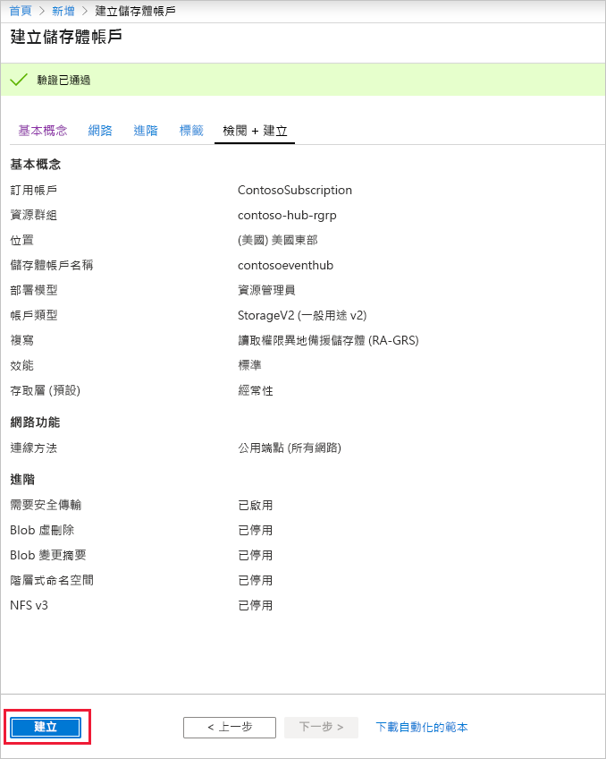
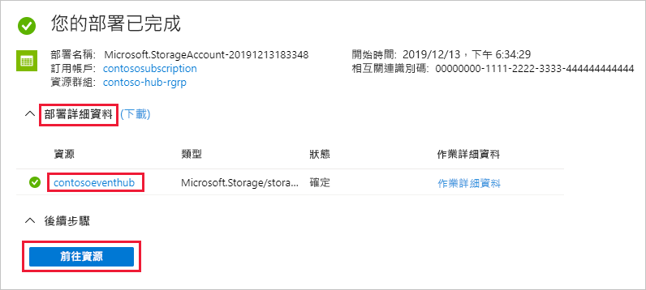
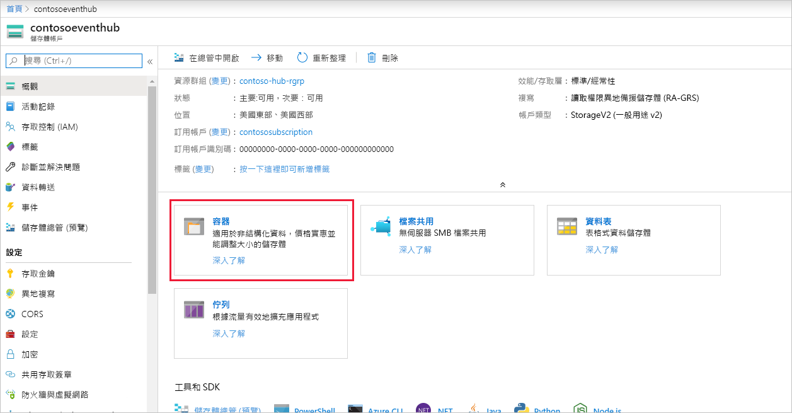
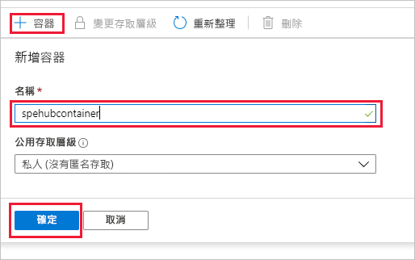

### 建立事件處理器主機的儲存體帳戶
事件處理器主機是一個智慧型代理程式，透過管理持續檢查點以及平行接收，簡化來自事件中樞的事件接收作業。 若要使用檢查點，事件處理器主機需要儲存體帳戶。 下列範例會示範如何建立儲存體帳戶，以及如何取得其存取金鑰：

1. 從 Azure 入口網站功能表選取 [建立資源]  。

    

2. 選取 [儲存體]   > [儲存體帳戶]  。
   
    

3. 在 [建立儲存體帳戶]  頁面上，採取以下步驟︰ 

   1. 輸入**儲存體帳戶名稱**。
   2. 選擇含有事件中樞的 Azure **訂用帳戶**。
   3. 選擇或建立具有事件中樞的**資源群組**。
   4. 選擇要在其中建立資源的**位置**。 
   5. 選取 [檢閱 + 建立]  。
   
        

4. 在 [檢閱 + 建立]  頁面上，檢閱每個值，然後選取 [建立]  。 

    
5. 在您的通知中看到**部署成功**訊息後，請選取 [前往資源]  以開啟 [儲存體帳戶] 頁面。 或者，您可以展開 [部署詳細資料]  ，然後從資源清單中選取新的資源。  

     
6. 選取 [容器]  。

    
7. 選取頂端的 [+ 容器]  輸入容器的 [名稱]  ，然後選取 [確定]  。 

    
8. 從 [儲存體帳戶]  頁面功能表中選擇 [存取金鑰]  ，然後複製 **key1** 的值。

    將下列值儲存到「記事本」或一些其他暫存位置。
    - 儲存體帳戶的名稱
    - 儲存體帳戶的存取金鑰
    - 容器的名稱
