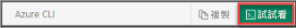

本文使用 PowerShell Cmdlet。 若要執行 Cmdlet，您可以透過瀏覽器使用裝載於 Azure 中的互動式殼層環境 Azure Cloud Shell。 Azure Cloud Shell 隨附於預先安裝的 Azure PowerShell Cmdlet。

若要在 Azure Cloud Shell 上執行本文所包含的任何程式碼，請開啟 Cloud Shell 工作階段、使用某個程式碼區塊上的 [複製] 按鈕來複製程式碼，然後使用 __Ctrl+Shift+V__ (在 Windows 和 Linux 上) 或 __Cmd+Shift+V__ (在 macOS 上) 將程式碼貼到 Cloud Shell 工作階段中。 貼上的文字不會自動執行，因此請按 **Enter** 來執行程式碼。

您可以使用下列方式來啟動 Azure Cloud Shell：

|  |   |
|-----------------------------------------------|---|
| 選取程式碼區塊右上角的 [試試看]。 這__不會__自動將文字複製到 Cloud Shell。 |  |
| 在瀏覽器中開啟 [shell.azure.com](https://shell.azure.com)。 |  |
| 選取 [Azure 入口網站](https://portal.azure.com)右上角功能表上的 [Cloud Shell] 按鈕。 | ![Azure 入口網站中的 [Cloud Shell] 按鈕](./media/cloud-shell-try-it/hdi-cloud-shell-menu.png) |

如果您不想要使用 Azure Cloud Shell，請改為在本機安裝 Azure PowerShell。 請務必安裝最新版的 Azure PowerShell Az 模組，以取得最新的功能。 如需詳細資訊，請參閱[安裝 Azure PowerShell](/powershell/azure/overview) (英文)。
