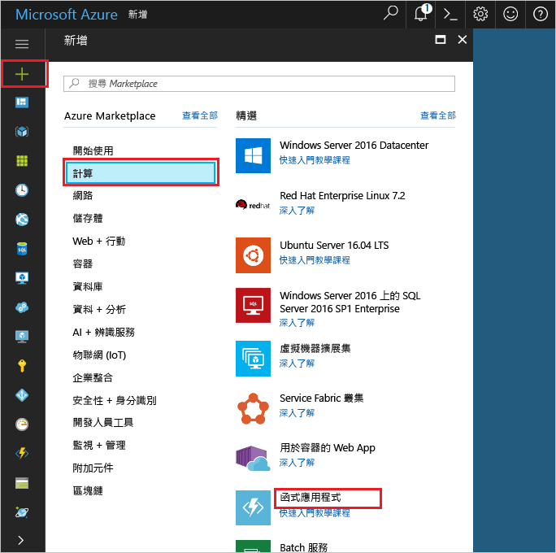
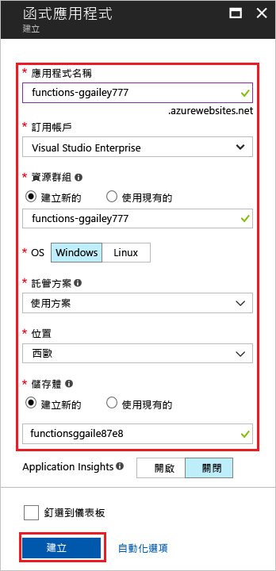
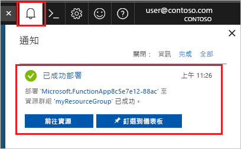

1. 選取 Azure 入口網站左上角的 [新增] 按鈕，然後選取 [計算] > [函式應用程式]。 

    

2. 請使用影像下面的資料表中指定的函式應用程式設定。

    

    | 設定      | 建議的值  | 說明                                        |
    | ------------ |  ------- | -------------------------------------------------- |
    | **應用程式名稱** | 全域唯一的名稱 | 用以識別新函式應用程式的名稱。 有效字元是 `a-z`、`0-9` 和 `-`。  | 
    | **訂用帳戶** | 您的訂用帳戶 | 將在其下建立這個新函式應用程式的訂用帳戶。 | 
    | **[資源群組](../articles/azure-resource-manager/resource-group-overview.md)** |  myResourceGroup | 要在其中建立函式應用程式的新資源群組名稱。 | 
    | **作業系統** | Windows | 無伺服器裝載目前只能在執行於 Windows 上時使用。 若為 Linux 裝載，請參閱[使用 Azure CLI 建立第一個在 Linux 上執行的函式](../articles/azure-functions/functions-create-first-azure-function-azure-cli-linux.md)。 |
    | **[主控方案](../articles/azure-functions/functions-scale.md)** | 取用方案 | 會定義如何將資源配置給函式應用程式的主控方案。 在預設**取用方案**中，您的函式會根據需要來動態新增資源。 在此[無伺服器](https://azure.microsoft.com/overview/serverless-computing/)裝載中，您只需要針對函式有執行的時間來付費。 在 App Service 方案中執行時，您必須管理[函式應用程式的調整](../articles/azure-functions/functions-scale.md)。  |
    | **位置** | 西歐 | 選擇與您接近的[區域](https://azure.microsoft.com/regions/)，或選擇與函式將會存取之其他服務接近的區域。 |
    | **[儲存體帳戶](../articles/storage/common/storage-quickstart-create-account.md)** |  全域唯一的名稱 |  函式應用程式所使用之新儲存體帳戶的名稱。 儲存體帳戶名稱必須介於 3 到 24 個字元的長度，而且只能包含數字和小寫字母。 您也可以使用現有帳戶，條件是必須符合[儲存體帳戶需求](../articles/azure-functions/functions-scale.md#storage-account-requirements)。 |

3. 選取 [建立] 以佈建並部署函式應用程式。

4. 選取入口網站右上角的 [通知] 圖示，查看是否有**部署成功**訊息。 

    

5. 選取 [前往資源]，以檢視您新的函式應用程式。

> [!TIP]
> 在入口網站中尋找您的函式應用程式時若發生問題，請嘗試[在 Azure 入口網站中將函式應用程式新增至您的最愛](../articles/azure-functions/functions-how-to-use-azure-function-app-settings.md#favorite)。   
