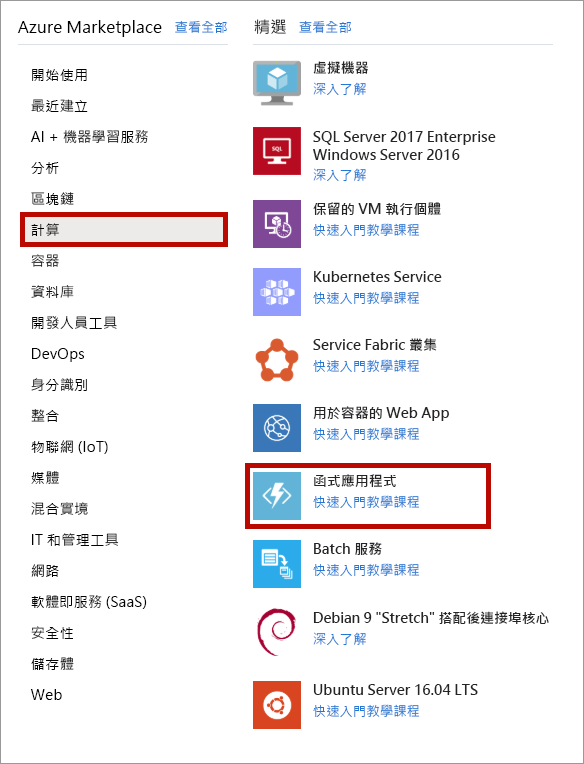
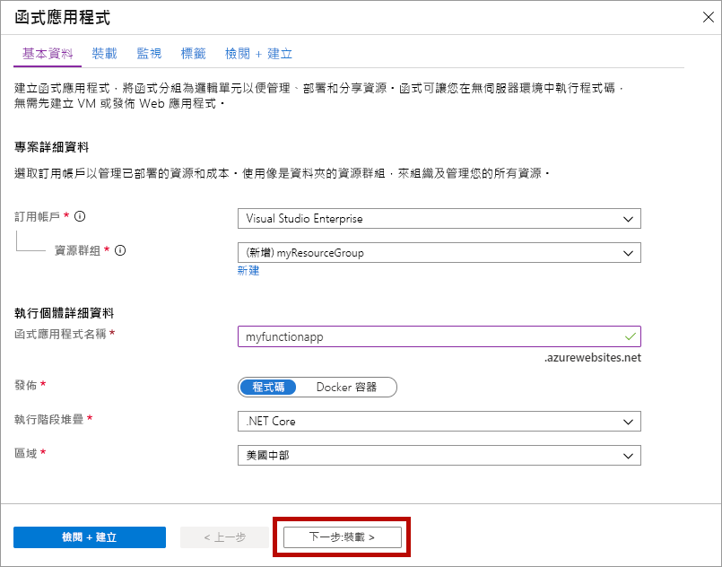
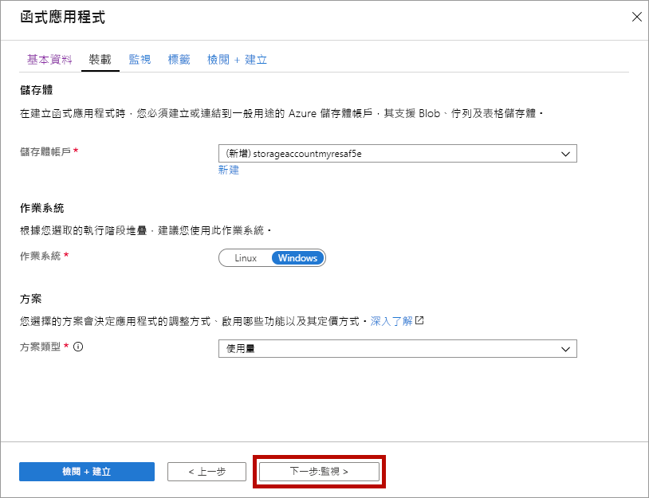
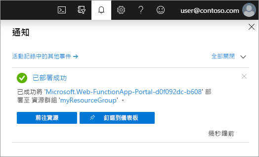

1. 從 [https://portal.azure.com](https://portal.azure.com) 開啟 Azure 入口網站

1. 選取 [建立資源]  按鈕

    

1. 選取 [計算]   > [函式應用程式]  。

    

1. 請使用影像下面的資料表中指定的函式應用程式設定。

    

    | 設定      | 建議的值  | 說明 |
    | ------------ | ---------------- | ----------- |
    | **訂用帳戶** | 您的訂用帳戶 | 將在其下建立這個新函式應用程式的訂用帳戶。 |
    | **[資源群組](../articles/azure-resource-manager/resource-group-overview.md)** |  *myResourceGroup* | 要在其中建立函式應用程式的新資源群組名稱。 |
    | **函式應用程式名稱** | 全域唯一的名稱 | 用以識別新函式應用程式的名稱。 有效字元為 `a-z` (區分大小寫)、`0-9` 以及 `-`。  |
    |**Publish**| 代碼 | 發佈程式碼檔案或 Docker 容器的選項。 |
    | **執行階段堆疊** | 慣用語言 | 選擇支援您慣用函式程式設計語言的執行階段。 針對 C# 和 F # 函式選擇 **.NET**。 |
    |**區域**| 慣用區域 | 選擇與您接近的[區域](https://azure.microsoft.com/regions/)，或選擇與函式將會存取之其他服務接近的區域。 |

    選取 [下一步:  裝載 >] 按鈕。

1. 輸入下列設定以進行裝載。

    

    | 設定      | 建議的值  | 說明 |
    | ------------ | ---------------- | ----------- |
    | **[儲存體帳戶](../articles/storage/common/storage-quickstart-create-account.md)** |  全域唯一的名稱 |  建立您函式應用程式使用的儲存體帳戶。 儲存體帳戶名稱必須介於 3 到 24 個字元的長度，而且只能包含數字和小寫字母。 您也可以使用現有帳戶，條件是必須符合[儲存體帳戶需求](../articles/azure-functions/functions-scale.md#storage-account-requirements)。 |
    |**作業系統**| 慣用的作業系統 | 系統會根據您的執行階段堆疊選項預先選取作業系統，但您可以視需要變更設定。 |
    | **[規劃](../articles/azure-functions/functions-scale.md)** | 取用方案 | 會定義如何將資源配置給函式應用程式的主控方案。 在預設**取用方案**中，您的函式會根據需要來動態新增資源。 在此[無伺服器](https://azure.microsoft.com/overview/serverless-computing/)裝載中，您只需要針對函式有執行的時間來付費。 在 App Service 方案中執行時，您必須管理[函式應用程式的調整](../articles/azure-functions/functions-scale.md)。  |

    選取 [下一步:  監視 >] 按鈕。

1. 輸入下列設定以進行監視。

    

    | 設定      | 建議的值  | 說明 |
    | ------------ | ---------------- | ----------- |
    | **[Application Insights](../articles/azure-functions/functions-monitoring.md)** | 預設值 | 在最近的支援區域中，建立相同*應用程式名稱*的 Application Insights 資源。 您可以展開此設定，變更 [新資源名稱]  或在 [Azure 地理位置](https://azure.microsoft.com/global-infrastructure/geographies/)中依您希望儲存資料的地點，選擇不同的**位置**。 |

    選取 [檢閱 + 建立]  ，以檢閱應用程式組態選項。

1. 選取 [建立]  以佈建並部署函式應用程式。

1. 選取入口網站右上角的 [通知] 圖示，查看是否有**部署成功**訊息。

    

1. 選取 [前往資源]  ，以檢視您新的函式應用程式。 您也可以選取 [釘選到儀表板]  。 釘選可讓您更輕鬆地從儀表板返回此函式應用程式資源。
