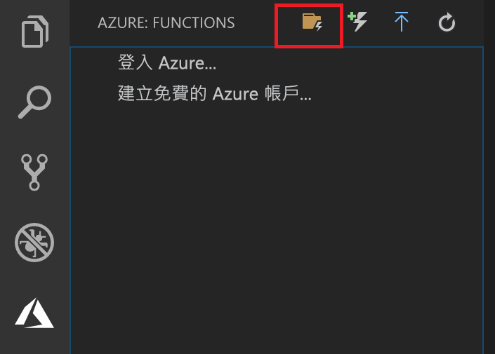

## 建立 Azure Functions 專案

Visual Studio Code 中的 Azure Functions 專案範本會建立可發佈至 Azure 中函式應用程式的專案。 函式應用程式可讓您將多個函式群組為邏輯單位，以便您管理、部署和共用資源。

1. 在 Visual Studio Code 中，選取 Azure 標誌以顯示 **[Azure：** 函式] 區域，然後選取 [建立新專案] 圖示。

    

1. 選擇您專案工作區的位置，然後選擇 [選取]。

    > [!NOTE]
    > 本文主要設計為在工作區以外的地方完成。 在此案例中，請勿選取屬於工作區的專案資料夾。

1. 為您的函式應用程式專案選取語言。 本文使用 JavaScript。
    

1. 出現提示時，請選擇 [新增到工作區]。

Visual Studio Code 會在新的工作區中建立函式應用程式專案。 此專案包含 [host.json](../articles/azure-functions/functions-host-json.md) 和 [local.settings.json](../articles/azure-functions/functions-run-local.md#local-settings-file) 組態檔，以及任何特定語言的專案檔。 您也可以在專案資料夾中取得新的 Git 存放庫。