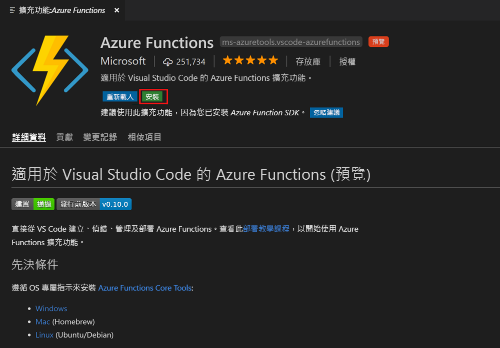
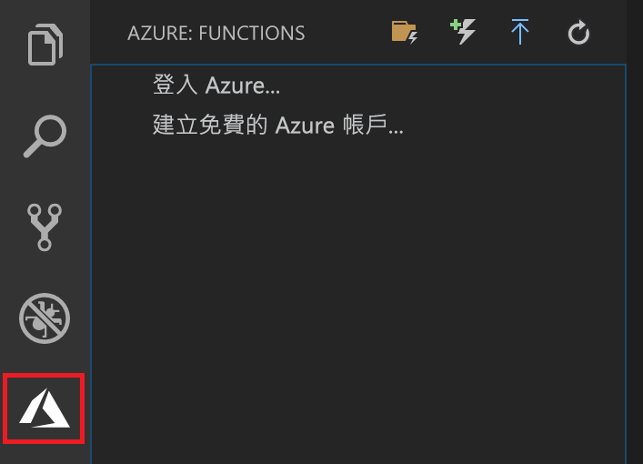

## 安裝 Azure Function 擴充功能

Azure Functions 擴充功能主要用來建立、測試及部署要放在 Azure 中的函式。

1. 在 Visual Studio Code 中，開啟 [擴充功能] 並搜尋 `azure functions`，或是，[在 Visual Studio Code 中開啟此連結](vscode:extension/ms-azuretools.vscode-azurefunctions)。

1. 選取 [安裝] 來將擴充功能安裝到 Visual Studio Code。

    

1. 重新啟動 Visual Studio Code，然後選取 [活動] 工作列上的 Azure 圖示。 您應該會在提要欄位中看到 Azure Functions 區域。

    