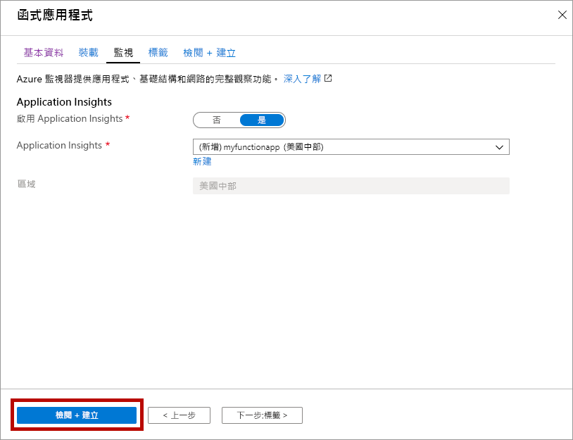

1. 從[https://portal.azure.com](https://portal.azure.com)開啟 Azure 入口網站

1. 選取 [**建立資源**] 按鈕

    

1. 選取 [**計算** > **函數應用程式**]。

    

1. 請使用影像下面的資料表中指定的函式應用程式設定。

    

    | 設定      | 建議的值  | 描述 |
    | ------------ | ---------------- | ----------- |
    | **訂用帳戶** | 您的訂用帳戶 | 將在其下建立這個新函式應用程式的訂用帳戶。 |
    | **[資源群組](../articles/azure-resource-manager/resource-group-overview.md)** |  *myResourceGroup* | 要在其中建立函式應用程式的新資源群組名稱。 |
    | **函數應用程式名稱** | 全域唯一的名稱 | 用以識別新函式應用程式的名稱。 有效的字元是 `a-z` （不區分大小寫）、`0-9`和 `-`。  |
    |**Publish**| 程式碼 | 發行程式碼檔案或 Docker 容器的選項。 |
    | **執行階段堆疊** | 慣用語言 | 選擇支援您慣用函式程式設計語言的執行階段。 針對 C# 和 F # 函式選擇 **.NET**。 |
    |**區域**| 慣用區域 | 選擇與您接近的[區域](https://azure.microsoft.com/regions/)，或選擇與函式將會存取之其他服務接近的區域。 |

    選取 [**下一步：裝載 >]** 按鈕。

1. 輸入下列裝載設定。

    

    | 設定      | 建議的值  | 描述 |
    | ------------ | ---------------- | ----------- |
    | **[儲存體帳戶](../articles/storage/common/storage-quickstart-create-account.md)** |  全域唯一的名稱 |  建立您函式應用程式使用的儲存體帳戶。 儲存體帳戶名稱必須介於 3 到 24 個字元的長度，而且只能包含數字和小寫字母。 您也可以使用現有的帳戶，這必須符合[儲存體帳戶的需求](../articles/azure-functions/functions-scale.md#storage-account-requirements)。 |
    |**作業系統**| 慣用的作業系統 | 系統會根據您的執行時間堆疊選取專案預先選取作業系統，但您可以視需要變更設定。 |
    | **[圖](../articles/azure-functions/functions-scale.md)** | 高級 | 針對 [方案類型]，選取 [ **Premium （預覽）** ]，然後選取 [ *Windows 方案*] 和 [ *Sku 和大小*] 選項的預設值。 |

    選取 [**下一步：監視 >]** 按鈕。

1. 輸入下列監視設定。

    

    | 設定      | 建議的值  | 描述 |
    | ------------ | ---------------- | ----------- |
    | **[Application Insights](../articles/azure-functions/functions-monitoring.md)** | 預設值 | 在最近的支援區域中，建立相同*應用程式名稱*的 Application Insights 資源。 您可以展開此設定，變更 [新資源名稱] 或在 [Azure 地理位置](https://azure.microsoft.com/global-infrastructure/geographies/)中依您希望儲存資料的地點，選擇不同的**位置**。 |

    選取 [**審查 + 建立**] 以審查應用程式設定選項。

1. 選取 [建立] 以佈建並部署函式應用程式。