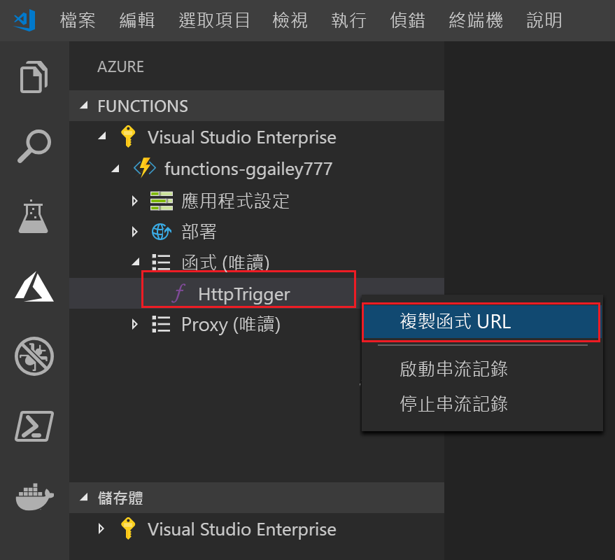

## 將專案發佈到 Azure

Visual Studio Code 可讓您將函式專案直接發佈到 Azure。 在這過程中，您會在 Azure 訂用帳戶中建立函式應用程式和相關的資源。 函式應用程式會為函式提供執行內容。 專案會封裝並部署到您 Azure 訂用帳戶中的新函式應用程式。

根據預設，Visual Studio 會建立所有建立函式應用程式所需的 Azure 資源。 這些資源的名稱會以您選擇的函式應用程式名稱為基礎。 如果您需要所建立資源的完整控制權，您可以[使用進階選項發佈](../articles/azure-functions/functions-develop-vs-code.md#enabled-publishing-with-advanced-create-options)。

本節假設您要在 Azure 中建立新的函式應用程式。

> [!IMPORTANT]
> 發佈至現有的函式應用程式會覆寫該應用程式在 Azure 中的內容。

1. 在 Visual Studio Code 中按 F1 以開啟命令選擇區。 在命令選擇區中，搜尋並選取 `Azure Functions: Deploy to function app...`。

1. 如果未登入，系統會提示您**登入 Azure**。 您也可以建立**免費 Azure 帳戶**。 從瀏覽器成功登入之後，請返回 Visual Studio Code。 

1. 如果您有多個訂用帳戶，請為函數應用程式**選取訂用帳戶**，然後選擇 [+ 在 Azure 中建立新函數應用程式]  。

1. 輸入可識別您函式應用程式的全域唯一名稱，然後按 Enter。 函式應用程式名稱的有效字元為 `a-z`、`0-9` 和 `-`。

    當您按下 Enter 時，您的訂用帳戶中會建立下列 Azure 資源：

    * **[資源群組](../articles/azure-resource-manager/resource-group-overview.md)** ：包含所有已建立的 Azure 資源。 該名稱是以您的函數應用程式名稱為根據。
    * **[儲存體帳戶](../articles/storage/common/storage-quickstart-create-account.md)** ：使用以您的函數應用程式名稱為根據的唯一名稱建立標準儲存體帳戶。
    * **[主控方案](../articles/azure-functions/functions-scale.md)** ：在美國西部區域建立一個取用方案，來裝載您的無伺服器函數應用程式。
    * **函數應用程式**：您的專案已部署到此新函數應用程式，並在其中執行。

    建立函式應用程式並套用部署套件之後，即會顯示通知。 在通知中選取 [檢視輸出]  ，即可檢視建立和部署結果，包括您所建立的 Azure 資源。

1. 返回 [Azure：  函式] 區域中，在訂用帳戶下展開新函數應用程式。 展開 [函式]  ，以滑鼠右鍵按一下 [HttpTrigger]  ，然後選擇 [複製函數 URL]  。

    
