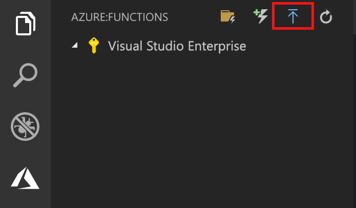

## 將專案發佈到 Azure

Visual Studio Code 可讓您將函式專案直接發佈到 Azure。 在這過程中，您會在 Azure 訂用帳戶中建立函式應用程式和相關的資源。 函式應用程式會為函式提供執行內容。 專案會封裝並部署到您 Azure 訂用帳戶中的新函式應用程式。

本文假設您要建立新的函式應用程式。 

> [!IMPORTANT]
> 發佈至現有的函式應用程式會覆寫該應用程式在 Azure 中的內容。

1. 在 [Azure：  函式] 區域中，選取 [部署至函數應用程式] 圖示。

    

1. 如果未登入，系統會提示您**登入 Azure**。 您也可以建立**免費 Azure 帳戶**。 從瀏覽器成功登入之後，請返回 Visual Studio Code。 

1. 如果您有多個訂用帳戶，請為函數應用程式**選取訂用帳戶**，然後選擇 [+ 在 Azure 中建立新函數應用程式]  。

1. 輸入可識別您函式應用程式的全域唯一名稱，然後按 Enter。 函式應用程式名稱的有效字元為 `a-z`、`0-9` 和 `-`。

1. 選擇 [+ 建立新的資源群組]  ，輸入資源群組名稱 (例如 `myResourceGroup`)，然後按 Enter 鍵。 您也可以使用現有的資源群組。

1. 選擇 [+ 建立新的儲存體帳戶]  ，輸入新儲存體帳戶的全域唯一名稱，以供您的函式應用程式使用，然後按 Enter。 儲存體帳戶名稱必須介於 3 到 24 個字元的長度，而且只能包含數字和小寫字母。 您也可以使用現有帳戶。

1. 在[區域](https://azure.microsoft.com/regions/)中選擇位置，此位置應靠近您或靠近函式會存取的其他服務。

    當您按下 Enter 時，您的訂用帳戶中會建立下列 Azure 資源：

    * **[資源群組](../articles/azure-resource-manager/resource-group-overview.md)** ：包含所有已建立的 Azure 資源。 該名稱是以您的函數應用程式名稱為根據。
    * **[儲存體帳戶](../articles/storage/common/storage-quickstart-create-account.md)** ：使用以您的函數應用程式名稱為根據的唯一名稱建立標準儲存體帳戶。
    * **[主控方案](../articles/azure-functions/functions-scale.md)** ：在美國西部區域建立一個取用方案，來裝載您的無伺服器函數應用程式。
    * **函數應用程式**：您的專案已部署到此新函數應用程式，並在其中執行。

    建立函式應用程式並套用部署套件之後，即會顯示通知。 在通知中選取 [檢視輸出]  ，即可檢視建立和部署結果，包括您所建立的 Azure 資源。

1. 返回 [Azure：  函式] 區域中，在訂用帳戶下展開新函數應用程式。 展開 [函式]  ，以滑鼠右鍵按一下 [HttpTrigger]  ，然後選擇 [複製函數 URL]  。

    
