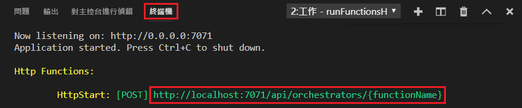

## 在本機執行函式

Azure Functions Core Tools 可讓您在本機開發電腦上執行 Azure Functions 專案。

1. 若要測試您的函式，可在函式程式碼中設定中斷點，並按 F5 以啟動函式應用程式專案。 Core Tools 的輸出會顯示在**終端機**面板中。

1. 在**終端機**面板中，複製 HTTP 觸發函式的 URL 端點。 

    

1. 將 HTTP 要求的 URL 貼到瀏覽器的網址列。 將查詢字串 `?name=<yourname>` 附加至此 URL 並執行要求。 觸及中斷點時，執行就會暫停。

1. 當您繼續此執行時，下圖顯示瀏覽器中對 GET 要求所做出的回應︰

    

1. 若要停止偵錯，請按 Shift + F5。
