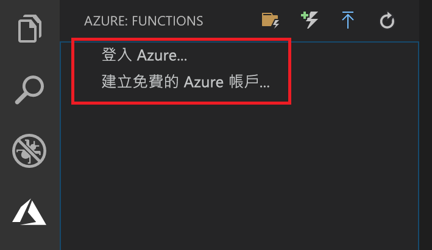

## 登入 Azure

您必須先登入 Azure，才能發佈您的應用程式。

1. 在 [Azure：  函式] 區域中，選擇 [登入 Azure...]  。如果您還沒有帳戶，您可以建立**免費的 Azure 帳戶**。

    

1. 出現提示時，選取 [複製及開啟]  ，或複製顯示的程式碼並在瀏覽器中開啟 <https://aka.ms/devicelogin>。

1. 在 [裝置登入]  頁面中貼上複製的程式碼，確認登入 Visual Studio Code，然後選取 [繼續]  。  

1. 使用您的 Azure 帳戶認證完成登入。 順利登入之後，您可以關閉瀏覽器。
