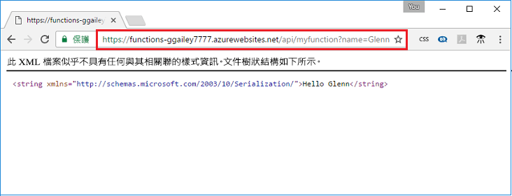

## <a name="test"></a>在 Azure 測試函式

使用 cURL 來測試已部署的函式。 使用您從上一個步驟複製的 URL，將查詢字串 `&name=<yourname>` 附加至 URL，如下列範例所示：

```bash
curl https://myfunctionapp.azurewebsites.net/api/httptrigger?code=cCr8sAxfBiow548FBDLS1....&name=<yourname>
```

 

您也可以將複製的 URL 貼至網頁瀏覽器的位址。 同樣地，先將查詢字串 `&name=<yourname>` 附加至 URL，然後再執行要求。

  
