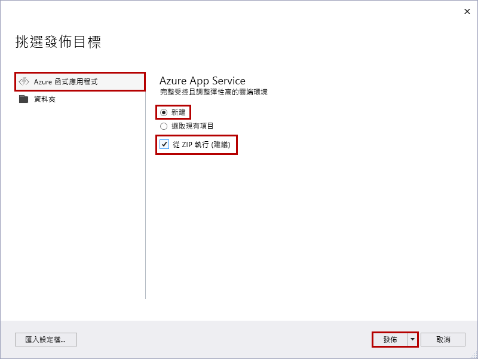
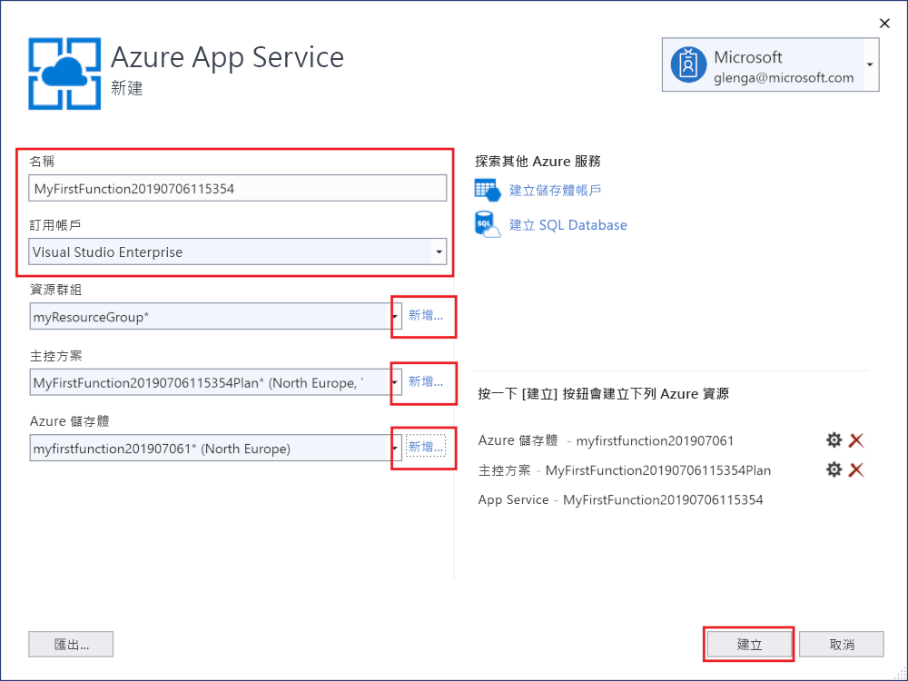
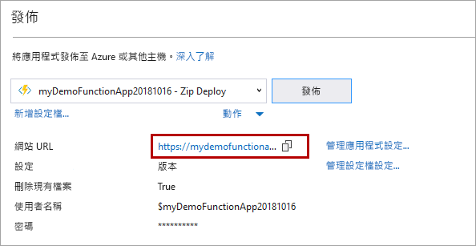

1. 在 [方案總管]  中，以滑鼠右鍵按一下專案並選取 [發佈]  。

2. 在 [挑選發佈目標]  對話方塊中，使用影像下方表格中所指定的發佈選項： 

    

    | 選項      | 說明                                |
    | ------------ |  -------------------------------------------------- |
    | **Azure Functions 取用方案** |   當您將專案發佈至在[取用方案](../articles/azure-functions/functions-scale.md#consumption-plan)中執行的函式應用程式時，您只需支付您的函式應用程式執行費用。 其他主控方案會產生較高的成本。 若要深入了解，請參閱 [Azure Functions 規模調整和主控](../articles/azure-functions/functions-scale.md)。 | 
    | **建立新項目** | 在 Azure 中會建立具有相關資源的新函式應用程式。 當您選擇 [選取現有的]  ，Azure 中現有函式應用程式的所有檔案都會以本機專案中的檔案加以覆寫。 請在將更新重新發佈至現有函式應用程式時，才使用此選項。 |
    | **從套件檔案執行** | 您的函式應用程式會使用已啟用[從套件執行](../articles/azure-functions/run-functions-from-deployment-package.md)模式的 [Zip 部署](../articles/azure-functions/functions-deployment-technologies.md#zip-deploy)來部署。 這是執行函式的建議方法，其可產生更好的效能。 若不使用此選項，請務必在發佈到 Azure 前，先停止在本機執行函式應用程式專案。 |

3. 選取 [發佈]  。 如果您尚未從 Visual Studio 登入您的 Azure 帳戶，請選取 [登入]  。 您也可以建立免費 Azure 帳戶。

4. 在 [App Service:  新建] 對話方塊中，使用影像下方表格中指定的 [主控]  設定：

    

    | 設定      | 建議的值  | 說明                                |
    | ------------ |  ------- | -------------------------------------------------- |
    | **名稱** | 全域唯一的名稱 | 用以唯一識別新函式應用程式的名稱。 有效字元是 `a-z`、`0-9` 和 `-`。 |
    | **訂用帳戶** | 選擇您的訂用帳戶 | 要使用的 Azure 訂用帳戶。 |
    | **[資源群組](../articles/azure-resource-manager/resource-group-overview.md)** | myResourceGroup |  要在其中建立函式應用程式的資源群組名稱。 選擇 [新增]  以建立新的資源群組。|
    | **[主控方案](../articles/azure-functions/functions-scale.md)** | 取用方案 | 在您選取 [新增]  以建立無伺服器方案之後，請務必選擇 [大小]  之下的 [取用]  。 或者，在[區域](https://azure.microsoft.com/regions/)中選擇您附近的 [位置]  ，或選擇與函式將會存取之其他服務接近的位置。 在**取用**以外的方案中執行時，您必須管理[函式應用程式的調整](../articles/azure-functions/functions-scale.md)。  |
    | **[Azure 儲存體](../articles/storage/common/storage-quickstart-create-account.md)** | 一般用途的儲存體帳戶 | Functions 執行階段需要 Azure 儲存體帳戶。 選取 [新增]  以建立一般用途的儲存體帳戶。 您也可以使用符合[儲存體帳戶需求](../articles/azure-functions/functions-scale.md#storage-account-requirements)的現有帳戶。  |

5. 選取 [建立]  以在 Azure 中使用這些設定建立函式應用程式和相關資源，並且部署函式專案程式碼。 

6. 部署完成之後，請記下 [網站 URL]  值，這是 Azure 中您函式應用程式的位址。

    
