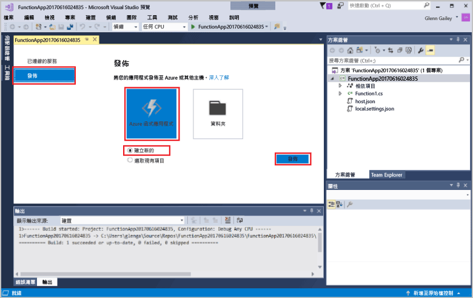

1. 在 [方案總管] 中，以滑鼠右鍵按一下專案並選取 [發佈]。 選擇 [新建]，然後按一下 [發佈]。 

    

2. 如果您已將 Visual Studio 連線到您的 Azure 帳戶，請選取 [新增帳戶...]。  

3. 在 [建立 App Service] 對話方塊中，使用如下表中指定的 [主機] 設定： 

    

    | 設定      | 建議的值  | 說明                                |
    | ------------ |  ------- | -------------------------------------------------- |
    | **應用程式名稱** | 全域唯一的名稱 | 用以唯一識別新函式應用程式的名稱。 |
    | **訂用帳戶** | 選擇您的訂用帳戶 | 要使用的 Azure 訂用帳戶。 |
    | **[資源群組](../articles/azure-resource-manager/resource-group-overview.md)** | myResourceGroup |  要在其中建立函式應用程式的資源群組名稱。 選擇 [新增] 以建立新的資源群組。|
    | **[App Service 方案](../articles/azure-functions/functions-scale.md)** | 取用方案 | 在您按一下 [新增] 以建立新的方案之後，請務必選擇 [大小] 之下的 [取用]。 或者，在[區域](https://azure.microsoft.com/regions/)中選擇您附近的 [位置]，或選擇與函式將會存取之其他服務接近的位置。  |

    >[!NOTE]
    >Functions 執行階段需要 Azure 儲存體帳戶。 基於此原因，當您建立函式應用程式時會為您建立新的 Azure 儲存體帳戶。

4. 按一下 [建立] 以在 Azure 中使用這些設定建立函式應用程式和相關資源，並且部署函式專案程式碼。 

5. 部署完成之後，請記下 [網站 URL] 值，這是 Azure 中您函式應用程式的位址。

    
