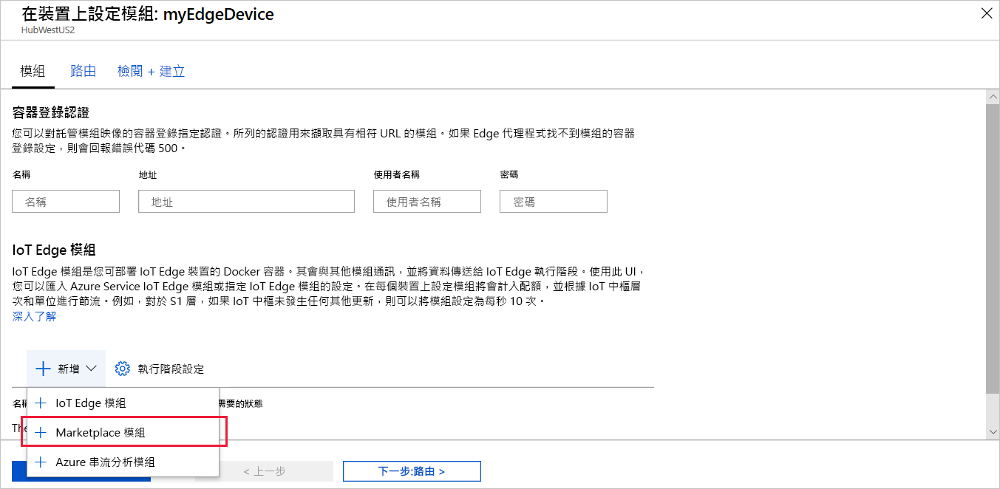
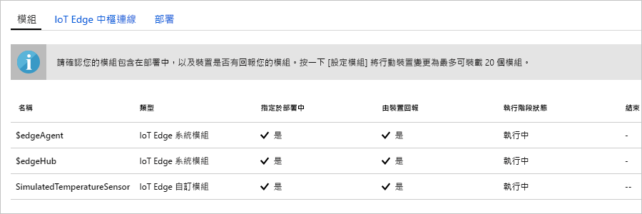

Azure IoT Edge 的主要功能之一，是能夠從雲端將程式碼部署到您的 IoT Edge 裝置。 **IoT Edge 模組**是實作為容器的可執行檔套件。 在本節中，您會從 [Azure Marketplace 的 IoT Edge 模組區段](https://azuremarketplace.microsoft.com/marketplace/apps/category/internet-of-things?page=1&subcategories=iot-edge-modules)部署預先建置的模組。 

您在本節中部署的模組會模擬感應器，並傳送產生的資料。 當您開始使用 IoT Edge 時，此模組會是很有用的一組程式碼，因為您可以使用模擬的資料進行開發和測試。 如果您想要清楚檢視此模組的運作情形，您可以檢視[模擬溫度感應器的原始程式碼](https://github.com/Azure/iotedge/blob/027a509549a248647ed41ca7fe1dc508771c8123/edge-modules/SimulatedTemperatureSensor/src/Program.cs)。 

若要從 Azure Marketplace 部署您的第一個模組，請使用下列步驟：

1. 在 [Azure 入口網站](https://portal.azure.com)的搜尋中輸入**模擬溫度感應器**，並開啟 Marketplace 結果。

   

2. 選擇用來接收此模組的 IoT Edge 裝置。 在 [IoT Edge 模組的目標裝置]  頁面上，提供下列資訊：

   1. **訂用帳戶**：選取您要使用的 IoT 中樞所屬的訂用帳戶。

   2. **IoT 中樞**：選取您要使用的 IoT 中樞名稱。

   3. **IoT Edge 裝置名稱**：如果您在本快速入門中使用先前建議的裝置名稱，請輸入 **myEdgeDevice**。 或者，請選取 [尋找裝置]  ，從 IoT 中樞的 IoT Edge 裝置清單中選擇裝置。 
   
   4. 選取 [建立]  。

3. 您現在已從 Azure Marketplace 中選擇 IoT Edge 模組，並選擇用來接收模組的 IoT Edge 裝置，接著您將前往可協助您明確定義如何部署模組的三步驟精靈。 在精靈的 [新增模組]  步驟中，您應留意 **SimulatedTemperatureSensor** 模組會自動填入。 在後續的教學課程中，您將使用此頁面將其他模組新增至您的部署。 在本快速入門中，只要部署此模組即可。 選取 [下一步]  ，繼續進行精靈的下一個步驟。

4. 在精靈的 [指定路由]  步驟中，您會定義在模組之間傳遞訊息以及將訊息傳遞至 IoT 中樞的方式。 在本快速入門中，您想要將所有模組的所有訊息傳至 IoT 中樞 (`$upstream`)。 若未自動填入，請新增下列程式碼，然後選取 [下一步]  ：

   ```json
    {
    "routes": {
        "route": "FROM /messages/* INTO $upstream"
        }
    }
   ```

5. 在精靈的 [檢閱部署]  步驟中，您可以預覽 JSON 檔案；此檔案定義了所有部署至 IoT Edge 裝置的模組。 請注意，**SimulatedTemperatureSensor** 模組也會包含在其中，此外還有兩個名為 **edgeAgent** 和 **edgeHub** 的系統模組。 檢閱完畢後，請選取 [提交]  。

   當您將新的部署提交至 IoT Edge 裝置時，並沒有任何項目會推送至您的裝置。 此時，裝置會定期查詢 IoT 中樞以取得新的指示。 裝置在發現更新的部署資訊清單時，即會使用新部署的相關資訊從雲端提取模組映像，然後開始在本機執行模組。 此流程可能需要幾分鐘的時間。 

6. 在您提交模組部署詳細資料後，精靈會讓您回到 IoT 中樞的 [IoT Edge]  頁面。 從 IoT Edge 裝置清單中選取您的裝置，可查看其詳細資料。 

7. 在裝置詳細資料頁面上，向下捲動至 [模組]  區段。 該處應會列出三個模組：$edgeAgent、$edgeHub 和 SimulatedTemperatureSensor。 如果有一或多個模組已依照部署中的指定列出，但裝置尚未加以報告，表示您的 IoT Edge 裝置仍在啟動這些模組。 請稍待片刻，然後選取頁面頂端的 [重新整理]  。 

   
