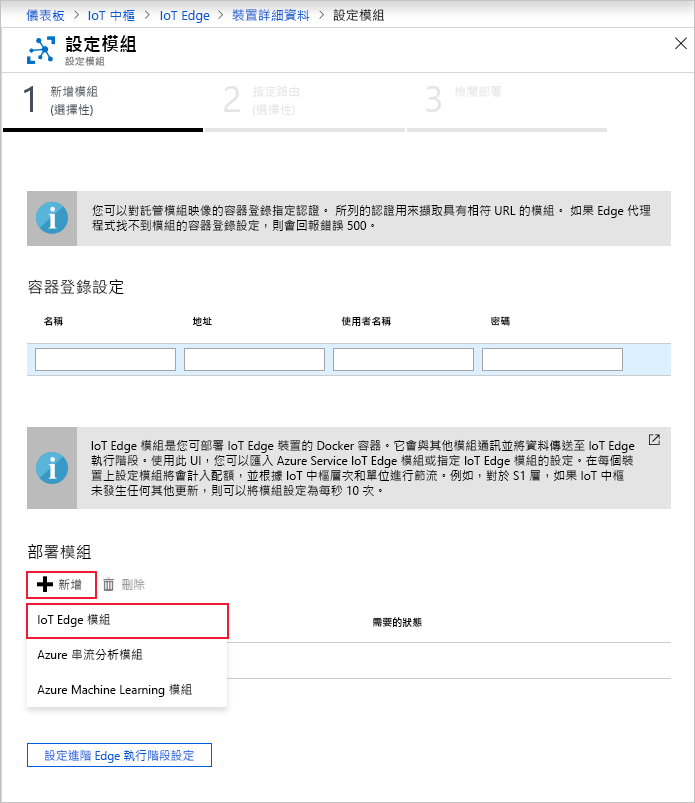

Azure IoT Edge 的主要功能之一，是能夠從雲端將模組部署到您的 IoT Edge 裝置。 IoT Edge 模組是實作為容器的可執行檔套件。 在本節中，您部署的模組會產生模擬裝置的遙測。

1. 在 Azure 入口網站中，瀏覽至您的 IoT 中樞。

2. 移至 [自動裝置管理] 下的 [IoT Edge]，然後選取您的 IoT Edge 裝置。

3. 選取 [設定模組]。 三個步驟的精靈會在入口網站中開啟，以引導您新增模組、指定路由，以及檢閱部署。 

4. 在精靈的 [新增模組] 步驟中，尋找 [部署模組] 區段。 按一下 [新增]，然後選取 [IoT Edge 模組]。

   

5. 在 [名稱] 欄位中，輸入 `tempSensor`。

6. 在 [映像 URI] 欄位中，輸入 `mcr.microsoft.com/azureiotedge-simulated-temperature-sensor:1.0`。

7. 其他設定保留不變，然後選取 [儲存]。

   

8. 回到精靈的第一個步驟中，選取 [下一步]。

9. 在精靈的 [指定路由] 步驟中，您應該會有可將所有模組的所有訊息傳送至 IoT 中樞的預設路由。 如果沒有，請新增下列程式碼，然後選取 [下一步]。

   ```json
   {
       "routes": {
           "route": "FROM /messages/* INTO $upstream"
       }
   }
   ```

10. 在精靈的 [檢閱部署] 步驟中，選取 [提交]。

11. 返回裝置的詳細資料頁面，選取 [重新整理]。 除了您第一次啟動服務時所建立的 edgeAgent 模組以外，您應該還會看到名為 **edgeHub** 的另一個執行階段模組和 **tempSensor** 模組均列出。

   新模組可能需要幾分鐘才會出現。 IoT Edge 裝置必須從雲端擷取其新的部署資訊、啟動容器，然後向 IoT 中樞回報其新的狀態。 

   
