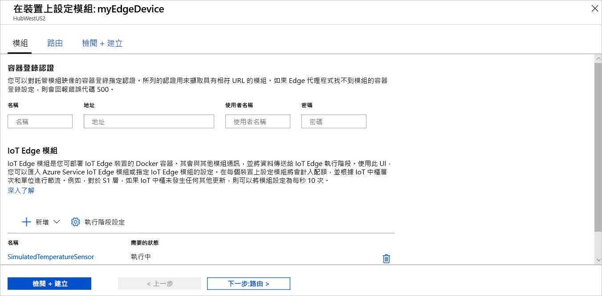

Azure IoT Edge 的主要功能之一，是能夠從雲端將程式碼部署到您的 IoT Edge 裝置。 **IoT Edge 模組**是實作為容器的可執行檔套件。 在本節中，您會直接透過 Azure IoT 中樞，從 [Azure Marketplace 的 IoT Edge 模組區段](https://azuremarketplace.microsoft.com/marketplace/apps/category/internet-of-things?page=1&subcategories=iot-edge-modules)部署預先建置的模組。

您在本節中部署的模組會模擬感應器，並傳送產生的資料。 當您開始使用 IoT Edge 時，此模組會是很有用的一組程式碼，因為您可以使用模擬的資料進行開發和測試。 如果您想要清楚檢視此模組的運作情形，您可以檢視[模擬溫度感應器的原始程式碼](https://github.com/Azure/iotedge/blob/027a509549a248647ed41ca7fe1dc508771c8123/edge-modules/SimulatedTemperatureSensor/src/Program.cs)。

若要從 Azure Marketplace 部署您的第一個模組，請使用下列步驟：

1. 登入 [Azure 入口網站](https://portal.azure.com)，然後瀏覽至 IoT 中樞。

1. 從左窗格上的功能表，在 [自動裝置管理]  下方選取 [IoT Edge]  。

1. 從裝置清單中按一下目標裝置的裝置識別碼。

1. 在上方列中，選取 [設定模組]  。

1. 在頁面的 [IoT Edge 模組]  區段中，按一下 [新增]  。

1. 從下拉式功能表中選取 [Marketplace 模組]  。

   

1. 在 [IoT Edge 模組 Marketplace]  中，搜尋「模擬溫度感應器」，然後選取該模組。

1. 請注意，SimulatedTemperatureSensor 模組會自動填入。 在後續的教學課程中，您將使用此頁面將其他模組新增至您的部署。 在本快速入門中，只要部署此模組即可。 這是公用的，因此不需要認證。

   

   完成時，選取 [下一步:**路由]** ，繼續進行精靈的下一個步驟。

1. 在精靈的 [路由]  索引標籤上，請定義要用來在模組與 IoT 中樞之間傳遞訊息的方式。 訊息會使用名稱/值組構成。 在本快速入門中，您想要將所有模組的所有訊息傳至 IoT 中樞 (`$upstream`)。 若未自動填入，請為**名稱** `upstream` 的**值**新增下列程式碼：

   ```sql
    FROM /messages/* INTO $upstream
   ```

   完成時，選取 [下一步:**檢閱 + 建立]** ，繼續進行精靈的下一個步驟。

1. 在精靈的 [檢閱 + 建立]  索引標籤上，您可以預覽 JSON 檔案；此檔案定義了所有部署至 IoT Edge 裝置的模組。 請注意，**SimulatedTemperatureSensor** 模組也會包含在其中，此外還有兩個名為 **edgeAgent** 和 **edgeHub** 的系統模組。 完成檢閱後，請選取 [建立]  。

   當您將新的部署提交至 IoT Edge 裝置時，並沒有任何項目會推送至您的裝置。 此時，裝置會定期查詢 IoT 中樞以取得新的指示。 裝置在發現更新的部署資訊清單時，即會使用新部署的相關資訊從雲端提取模組映像，然後開始在本機執行模組。 此流程可能需要幾分鐘的時間。

1. 在您建立模組部署詳細資料後，精靈會讓您回到 IoT 中樞的 [IoT Edge]  頁面。 從 IoT Edge 裝置清單中選取您的裝置，可查看其詳細資料。

1. 在裝置詳細資料頁面上，向下捲動至 [模組]  索引標籤。該處應會列出三個模組：$edgeAgent、$edgeHub 和 SimulatedTemperatureSensor。 如果有一或多個模組已依照部署中的指定列出，但裝置尚未加以報告，表示您的 IoT Edge 裝置仍在啟動這些模組。 請稍待片刻，然後選取頁面頂端的 [重新整理]  。

   
