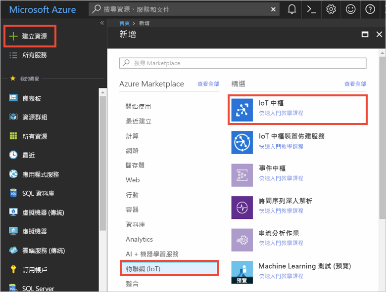
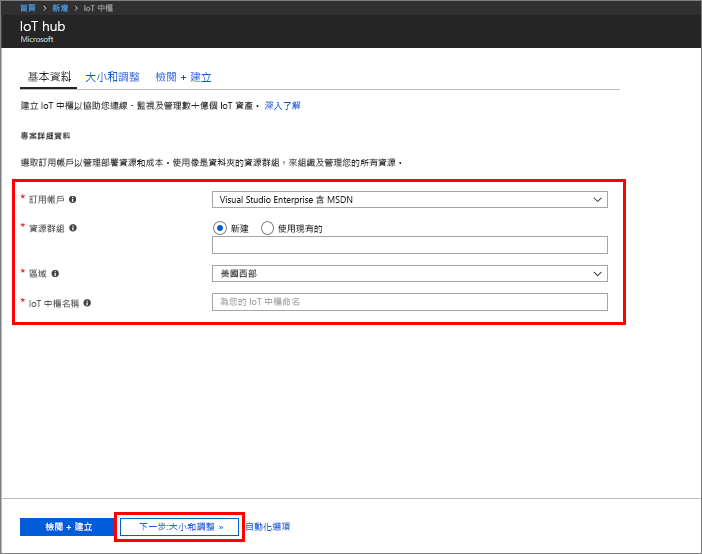
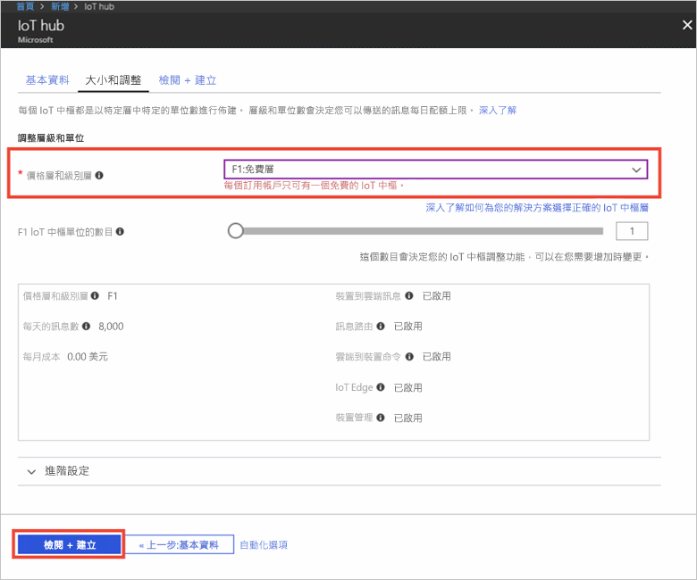

1. 登入 [Azure 入口網站](https://portal.azure.com/)。

2. 選取 [建立資源] > [物聯網] > [IoT 中樞]。
   
    

3. 在 [IoT 中樞] 窗格中，輸入 IoT 中樞的下列資訊︰

   * **訂用帳戶**：選擇您要用於建立此 IoT 中樞的訂用帳戶。

   * **資源群組**：建立用以裝載 IoT 中樞的資源群組，或使用現有資源群組。 如需詳細資訊，請參閱[使用資源群組管理您的 Azure 資源](../articles/azure-resource-manager/resource-group-portal.md)。

   * **區域**：選取最接近您的位置。

   * **名稱**：建立 IoT 中樞的名稱。 如果您輸入的名稱可用，則會出現綠色核取記號。

   [!INCLUDE [iot-hub-pii-note-naming-hub](iot-hub-pii-note-naming-hub.md)]

   

4. 選取 [下一步：大小和級別] 繼續建立 IoT 中樞。 

5. 選擇您的**定價與級別層**。 在本文中，選取 [F1-免費] 層 (如果仍可用於您的訂用帳戶)。 如需詳細資訊，請參閱[定價與級別層](https://azure.microsoft.com/pricing/details/iot-hub/)。

   

6. 選取 [檢閱 + 建立]。

7. 檢閱您的 IoT 中樞資訊，然後按一下 [建立]。 建立 IoT 中樞可能需要數分鐘。 您可以在 [通知] 窗格中監視進度。