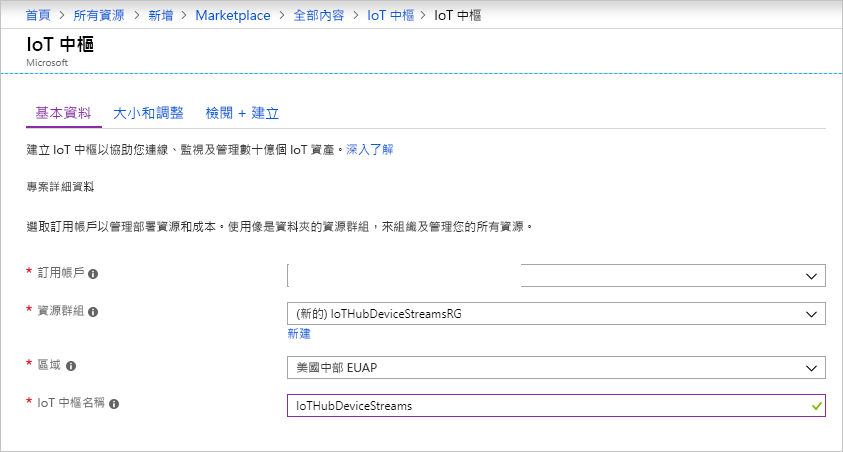
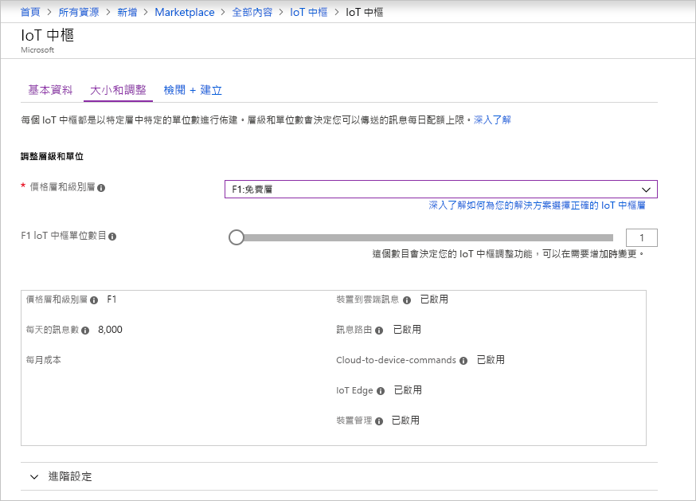
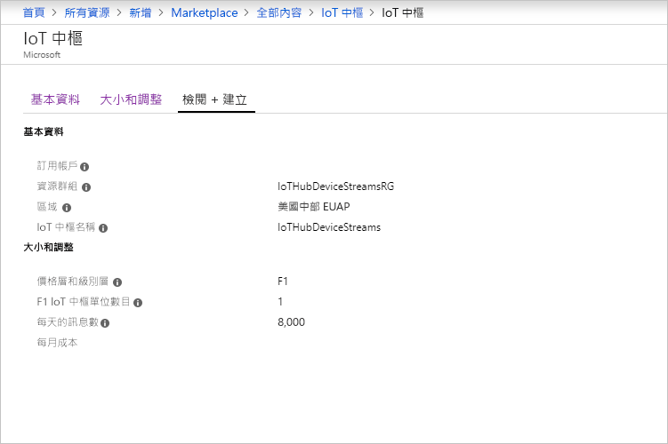

本節將說明如何使用 [Azure 入口網站](https://portal.azure.com)建立 IoT 中樞。

1. 登入 [Azure 入口網站](https://portal.azure.com)。

1. 選取 [建立資源]  ，然後選取 [物聯網]  。

1. 在右邊清單中，選取 [Iot 中樞]  。 用於建立 IoT 中樞的第一個頁面隨即開啟。

   

   填寫欄位：

   a. 在 [訂用帳戶]  下拉式清單中，選取要用於您的 IoT 中樞的訂用帳戶。

   b. 針對 [資源群組]  ，執行下列其中一個作業︰ 
      * 若要建立新的資源群組，請選取 [新建]  ，然後輸入您要使用的名稱。 
      * 若要使用現有的資源群組，請選取 [使用現有]  ，然後在下拉式清單中選取資源群組。 
      
        如需詳細資訊，請參閱[管理 Azure Resource Manager 資源群組](../articles/azure-resource-manager/manage-resource-groups-portal.md)。

   c. 在 [區域]  下拉式清單中，選取您要找出您中樞的區域。 選取支援 IoT 中樞裝置串流預覽的區域，可能是 [美國中部]  或 [美國中部 EUAP]  。

   d. 在 [IoT 名稱]  方塊中，輸入 IoT 中樞的名稱。 此名稱必須是全域唯一的。 如果您輸入的名稱可用，則會出現綠色核取記號。

   [!INCLUDE [iot-hub-pii-note-naming-hub](iot-hub-pii-note-naming-hub.md)]

1. 若要繼續建立 IoT 中樞，請選取 [下一步：  大小與級別]。

   

   在此窗格中，您可以接受預設設定並選取底部的 [檢閱 + 建立]  。 請考量下列選項：

   * 在 [定價與級別層]  下拉式清單中，選取其中一個標準層 (**S1**、**S2** 或 **S3**) 或 [F1：  免費層]。 這項選擇也可依據您的機群規模以及您預期中樞所將包含的非串流工作負載 (例如遙測訊息) 來決定。 例如，免費層適用於測試和評估。 它可允許 500 個裝置連接到 IoT 中樞，每天最多可允許 8,000 則訊息。 每個 Azure 訂用帳戶可以在免費層建立一個 IoT 中樞。 

   * 針對 [IoT 中樞單位數]  ：這項選擇取決於您預期中樞所將包含的非串流工作負載。 您可以暫且選取 1。

   如需層級選項的詳細資料，請參閱[選擇適合的 IoT 中樞層](../articles/iot-hub/iot-hub-scaling.md)。

1. 若要檢閱您的選擇，請選取 [檢閱 + 建立]  索引標籤。開啟的窗格如下所示：

   

1. 若要建立新的 IoT 中樞，請選取 [建立]  。 此程序需要幾分鐘的時間。
