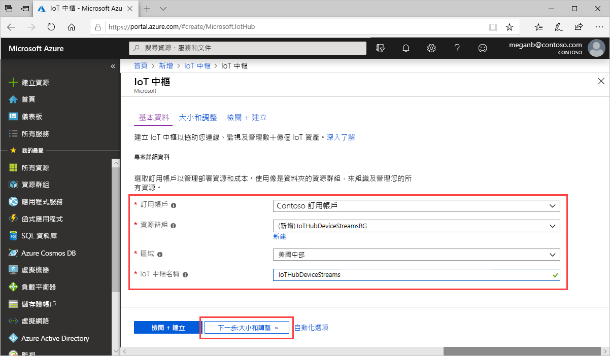

本節將說明如何使用 [Azure 入口網站](https://portal.azure.com)建立 IoT 中樞。

1. 登入 [Azure 入口網站](https://portal.azure.com)。

1. 選擇 [建立資源]  ，然後在 [搜尋 Marketplace]  欄位中輸入「IoT 中樞」  。

1. 從搜尋結果中選取 [IoT 中樞]  ，然後選取 [建立]  。

1. 在 [基本資料]  索引標籤上，完成如下所示的欄位：

   - 訂用帳戶  ：選取要為您的中樞使用的訂用帳戶。

   - **資源群組**：選取資源群組或建立新的資源群組。 若要建立新的資源群組，選取 [新建]  並填入您要使用的名稱。 若要使用現有資源群組，請選取該資源群組。 如需詳細資訊，請參閱[管理 Azure Resource Manager 資源群組](../articles/azure-resource-manager/manage-resource-groups-portal.md)。

   - **區域**：選擇您要放置中樞的區域。 選取支援 IoT 中樞裝置串流預覽的區域，可能是 [美國中部]  或 [美國中部 EUAP]  。

   - **IoT 中樞名稱**：輸入您的中樞名稱。 此名稱必須是全域唯一的。 如果您輸入的名稱可用，則會出現綠色核取記號。

   

   [!INCLUDE [iot-hub-pii-note-naming-hub](iot-hub-pii-note-naming-hub.md)]

1. 完成時，選取 [下一步:  大小與級別] 繼續建立中樞。

   

   在 [大小與級別]  中，您可以接受預設設定並選取底部的 [檢閱 + 建立]  。 請考量下列選項：

   - **定價與級別層**：您選取的階層。 選取其中一個標準層 (**S1**、**S2** 或 **S3**) 或 **[F1：** 免費層]。 這項選擇也可依據您的機群規模以及您預期中樞所將包含的非串流工作負載 (例如遙測訊息) 來決定。 例如，免費層適用於測試和評估。 它可允許 500 個裝置連接到 IoT 中樞，每天最多可允許 8,000 則訊息。 每個 Azure 訂用帳戶可以在免費層建立一個 IoT 中樞。 

   - **IoT 中樞單位數**：每天每單位允許的訊息數目取決於您的中樞定價層。 這項選擇取決於您預期中樞所將包含的非串流工作負載。 您可以暫且選取 1。

   - **進階設定** > **裝置到雲端的分割區**：此屬性會將裝置到雲端的訊息數與同時閱讀訊息的讀者數產生關聯。 大部分的中樞只需要四個分割區。

   如需層級選項的詳細資料，請參閱[選擇適合的 IoT 中樞層](../articles/iot-hub/iot-hub-scaling.md)。

1. 若要檢閱您的選擇，請選擇 [檢閱 + 建立]  。 結果將會類似於：

   

1. 若要建立新的 IoT 中樞，請選取 [建立]  。 此程序需要幾分鐘的時間。
