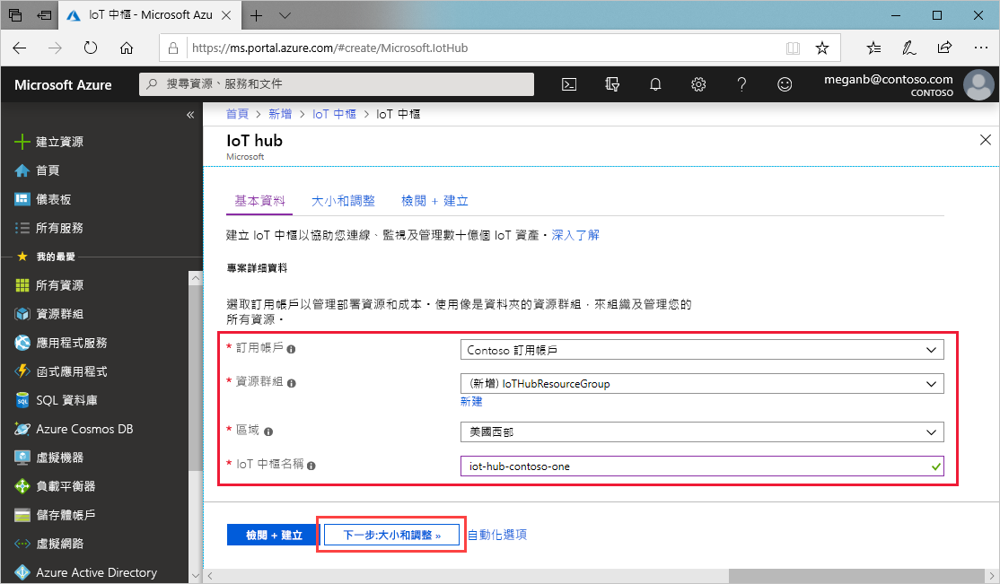
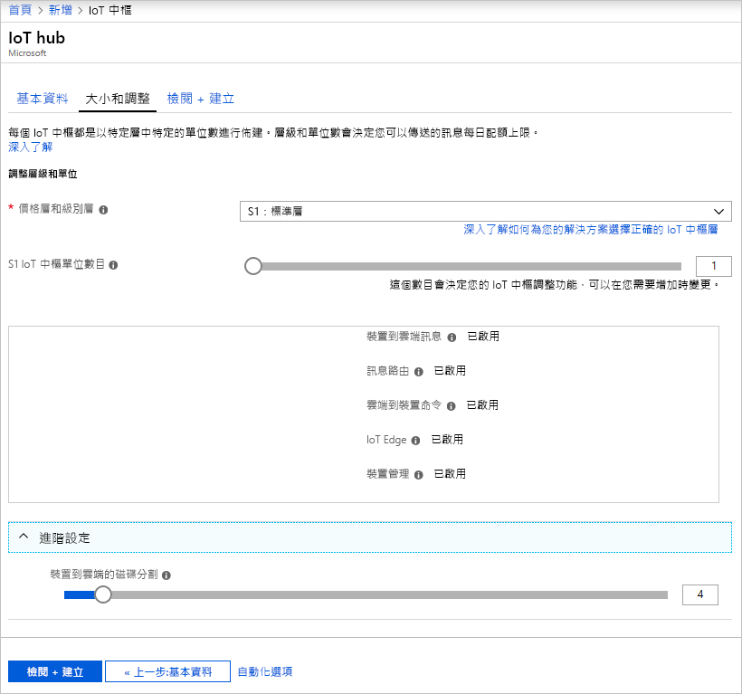

本節將說明如何使用 [Azure 入口網站](https://portal.azure.com)建立 IoT 中樞。

1. 登入 [Azure 入口網站](https://portal.azure.com)。

1. 選擇 [建立資源]  ，然後在 [搜尋 Marketplace]  欄位中輸入「IoT 中樞」  。

1. 從搜尋結果中選取 [IoT 中樞]  ，然後選取 [建立]  。

1. 在 [基本資料]  索引標籤上，完成如下所示的欄位：

   - 訂用帳戶  ：選取要為您的中樞使用的訂用帳戶。

   - **資源群組**：選取資源群組或建立新的資源群組。 若要建立新的資源群組，選取 [新建]  並填入您要使用的名稱。 若要使用現有資源群組，請選取該資源群組。 如需詳細資訊，請參閱[管理 Azure Resource Manager 資源群組](../articles/azure-resource-manager/manage-resource-groups-portal.md)。

   - **區域**：選取您要放置中樞的區域。 選取最靠近您的位置。

   - **IoT 中樞名稱**：輸入您的中樞名稱。 此名稱必須是全域唯一的。 如果您輸入的名稱可用，則會出現綠色核取記號。

   [!INCLUDE [iot-hub-pii-note-naming-hub](iot-hub-pii-note-naming-hub.md)]

   

1. 完成時，選取 [下一步:  大小與級別] 繼續建立中樞。

   

    此畫面可讓您設定下列值：

    - **定價與級別層**：您選取的階層。 您可以依據所需的功能多寡，以及每天透過解決方案傳送的訊息多寡，從數個層級中做選擇。 免費層適用於測試和評估。 它可允許 500 個裝置連接到中樞，每天最多可允許 8,000 則訊息。 每個 Azure 訂用帳戶可以在免費層建立一個「IoT 中樞」。

    - **IoT 中樞單位**：每天每單位允許的訊息數目取決於您的中樞定價層。 例如，如果您想要中樞支援 700,000 封訊息的輸入，您可以選擇 2 個 S1 層單位。
    如需有關其他層級選項的詳細資料，請參閱[選擇適合的 IoT 中樞層](../articles/iot-hub/iot-hub-scaling.md)。

    - **進階** > **裝置到雲端的分割區**：此屬性會將裝置到雲端的訊息數與同時閱讀訊息的讀者數產生關聯。 大部分的中樞只需要四個分割區。

1. 在本教學課程中，接受預設選項，然後選取 [檢閱及建立]  來檢閱您的選擇。 您會看到類似這個畫面的內容。

   

1. 選取 [建立]  以建立新的中樞。 建立中樞需要幾分鐘的時間。
