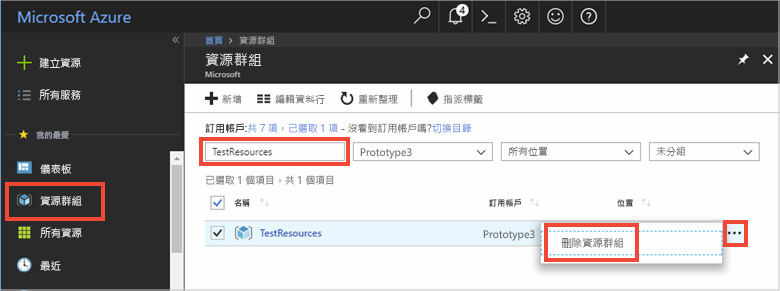

如果您將繼續閱讀下一篇建議的文章，則可以保留您已建立的資源，並重複加以使用。

否則，您可以刪除在本文中建立的 Azure 資源，以避免產生費用。 

> [!IMPORTANT]
> 刪除資源群組是無法回復的動作。 資源群組和其中包含的所有資源都將永久刪除。 請確定您不會不小心刪除錯誤的資源群組或資源。 如果您在現有的資源群組內建立了 IoT 中樞，而該群組中包含您想要保留的資源，則您只需刪除 IoT 中樞本身即可，而不要刪除資源群組。
>

若要依名稱刪除資源群組：

1. 登入 [Azure 入口網站](https://portal.azure.com)，然後按一下 [資源群組]。

2. 在 [依名稱篩選...] 文字方塊中，輸入包含 IoT 中樞的資源群組名稱。 

3. 在結果清單中的資源群組右側，按一下 **...**，然後按一下 [刪除資源群組]。

    

4. 系統將會要求您確認是否刪除資源。 再次輸入您的資源群組名稱進行確認，然後按一下 [刪除]。 片刻過後，系統便會刪除該資源群組及其所有內含的資源。