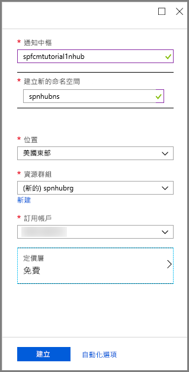
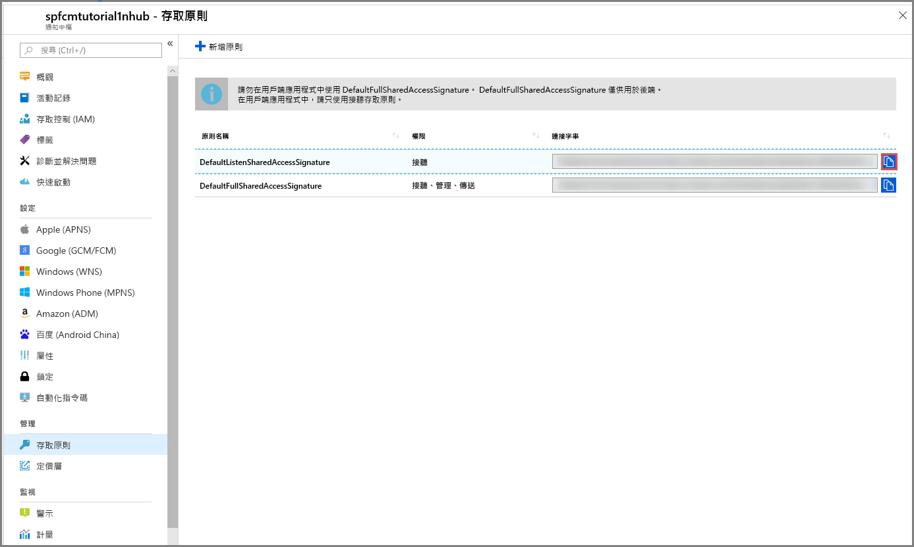

1. 登入 [Azure 入口網站](https://portal.azure.com)。

2. 選取 [建立資源] > [行動] > [通知中樞]。
   
      
      
3. 在 [通知中樞] 方塊中，輸入唯一的名稱。 選取您的 [區域]、[訂用帳戶] 和 [資源群組] \(如果您已經有的話)。 
   
      如果您還沒有服務匯流排命名空間，您可以使用預設名稱，根據中樞名稱建立此預設名稱 (如果命名空間名稱可用)。
    
      如果您已經有想要在其中建立中樞的服務匯流排命名空間，請遵循下列步驟

    a. 在 [命名空間] 區域中，選取 [選取現有] 連結。 
   
    b. 選取 [建立] 。
   
      

4. 選取 [通知] \(鈴鐺圖示)，然後選取 [前往資源]。 

          
5. 從清單中選取 [存取原則]。 請記下您可使用的兩個連接字串。 您稍後需要用到這些連接字串來處理推播通知。

      >[!IMPORTANT]
      >請**勿**在應用程式中使用 DefaultFullSharedAccessSignature。 這只能在後端使用。
      >
   
      

