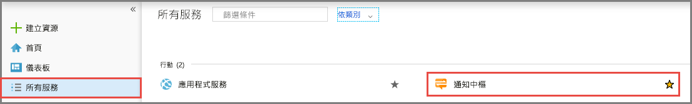
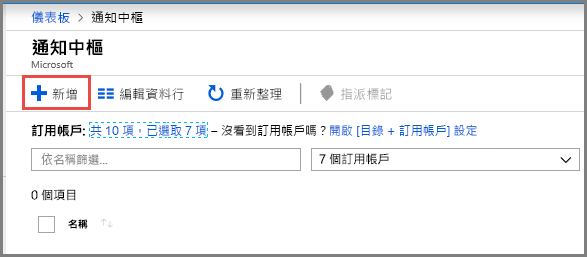
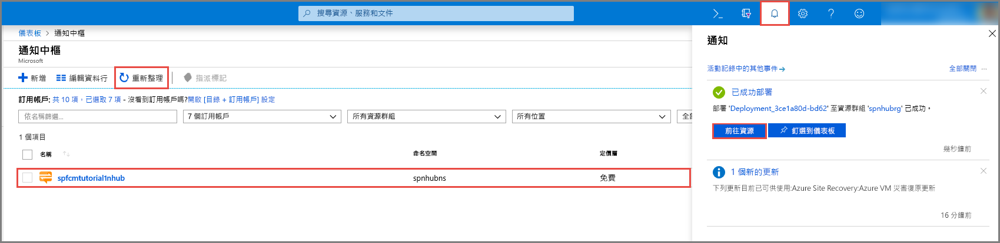

1. 登入 [Azure 入口網站](https://portal.azure.com)。
2. 選取左功能表上的 [所有服務]，然後選取 [行動] 區段中的 [通知中樞]。 選取服務名稱旁邊的星號 (`*`)，將它加到左功能表上的 [我的最愛] 區段。 在 [通知中樞] 加到 [我的最愛] 之後，在左功能表上予以選取。 

      
3. 在 [通知中樞] 頁面上，選取工具列上的 [新增]。 

      
4. 在 [通知中樞] 頁面上，執行下列步驟： 
    1. 指定通知**中樞**的**名稱**。  
    2. 指定**命名空間**的**名稱**。 命名空間包含一或多個中樞。 
    3. 選取您要在其中建立通知中樞的**位置**。 
    4. 選取現有的資源群組，或針對新的**資源群組**輸入名稱。
    5. 選取 [建立] 。 

        
4. 選取 [通知] \(鈴鐺圖示)，然後選取 [前往資源]。 您也可以重新整理 [通知中樞] 頁面中的清單，然後選取您的通知中樞。 

      
5. 從清單中選取 [存取原則]。 請記下您可使用的兩個連接字串。 您稍後需要用到這些連接字串來處理推播通知。

      >[!IMPORTANT]
      >請**勿**在應用程式中使用 DefaultFullSharedAccessSignature。 這只能在後端使用。
      >

      
