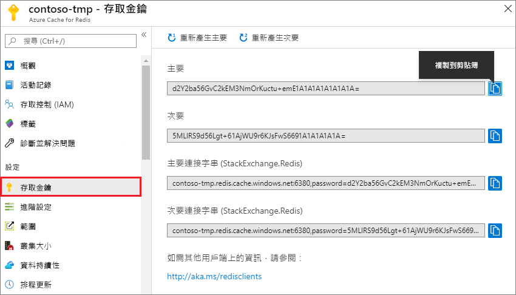
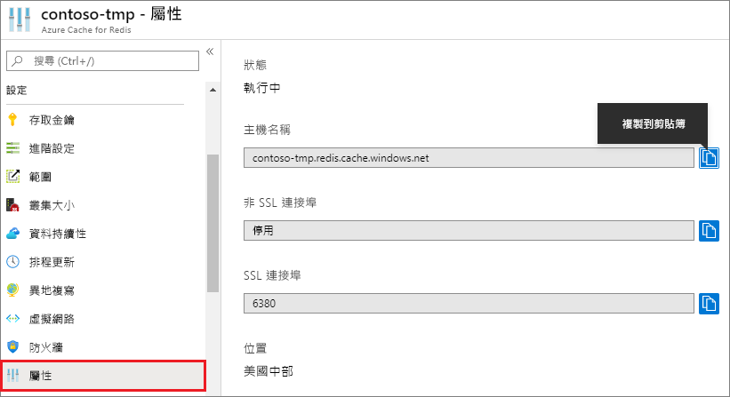

### 使用 Azure 入口網站來擷取主機名稱、連接埠及存取金鑰

在連接 Azure Redis 快取執行個體時，快取用戶端需要主機名稱、連接埠和快取金鑰。 某些用戶端可能會以稍有不同的名稱來參考這些項目。 您可以在 Azure 入口網站中擷取這些資訊。

#### 擷取存取金鑰和主機名稱

1. 若要使用 [Azure 入口網站](https://portal.azure.com)來擷取存取金鑰，請瀏覽至快取並選取 [存取金鑰]。 

    

2. 若要擷取主機名稱和連接埠，請選取 [屬性]。

    

