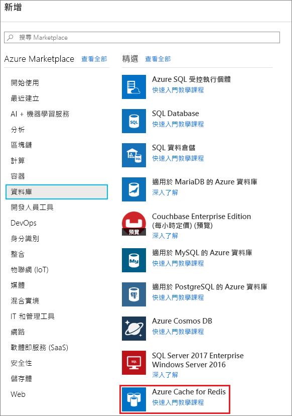
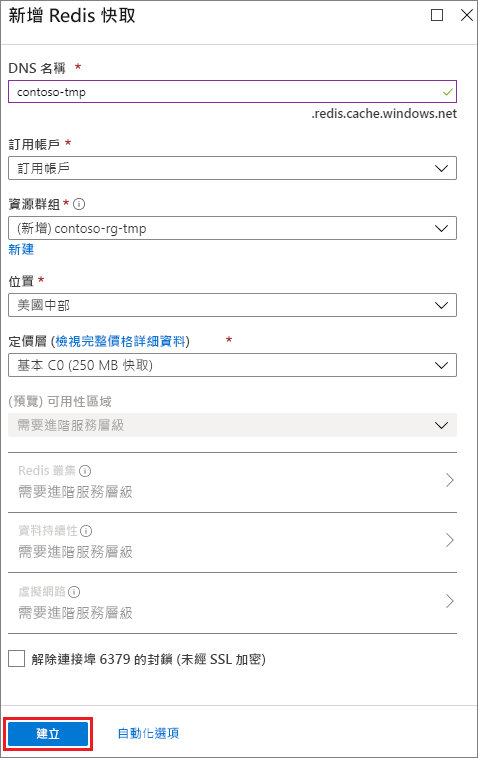

若要建立快取，請先登入 [Azure 入口網站](https://portal.azure.com)，然後按一下 [建立資源] > [資料庫] > [Redis 快取]。

在 [新的 Redis 快取] 中，配置新快取的設定。

| 設定      | 建議的值  | 說明 |
| ------------ |  ------- | -------------------------------------------------- |
| **DNS 名稱** | 全域唯一的名稱 | 快取名稱必須是介於 1 到 63 個字元的字串，而且只能包含數字、字母和 `-` 字元。 快取名稱的開頭或結尾不能是 `-` 字元，且連續的 `-` 字元無效。  | 
| **訂用帳戶** | 您的訂用帳戶 | 該新建立 Azure Redis 快取所在的訂用帳戶。 | 
| **資源群組** |  *TestResources* | 容納新建立快取的新資源群組名稱。 將應用程式的所有資源放在群組中，藉此同時管理。 例如，刪除資源群組會刪除所有與應用程式相關聯的資源。 | 
| **位置** | 美國東部 | 選擇其他將使用快取之服務的鄰近[區域](https://azure.microsoft.com/regions/)。 |
| **[定價層](https://azure.microsoft.com/pricing/details/cache/)** |  基本 C0 (250 MB 快取) |  快取的可用大小、效能和功能取決於定價層。 如需詳細資訊，請參閱 [Azure Redis 快取概觀](../articles/redis-cache/cache-overview.md)。 |
| **釘選到儀表板** |  已選取 | 按一下可將新快取釘選到儀表板，以便尋找。 |

 

配置新快取設定後，請按一下 [建立]。 

建立快取可能需要數分鐘的時間。 若要檢查狀態，您可以監視儀表板上的進度。 建立快取後，新快取的狀態會是**執行中**，而且已準備好供您使用。

