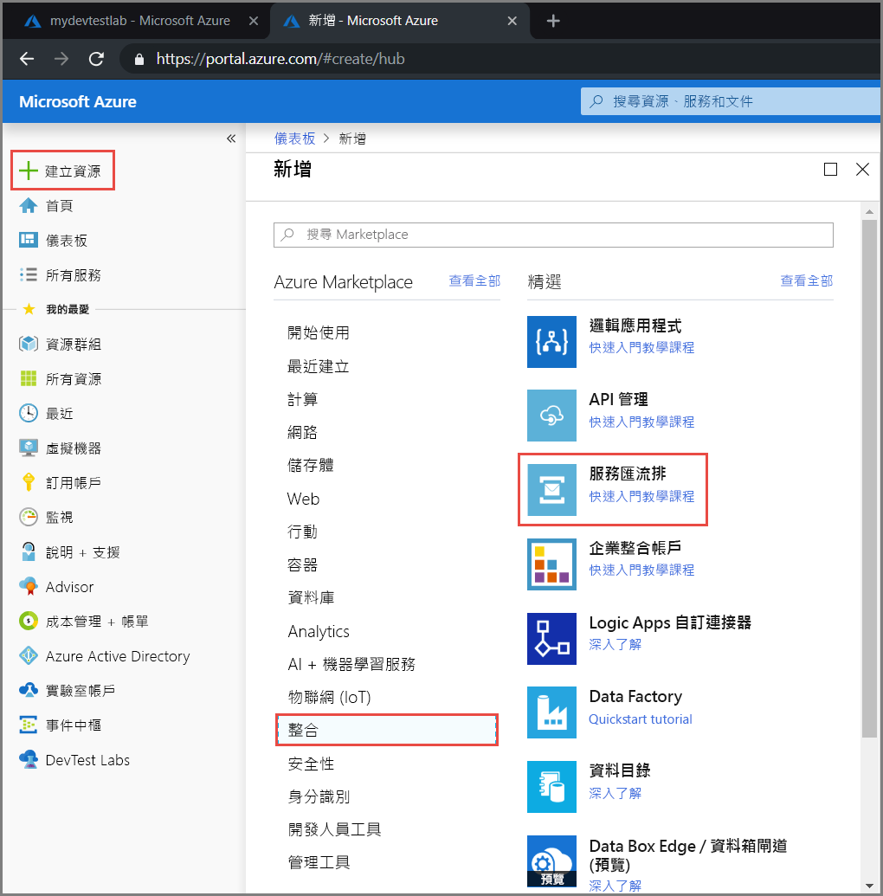
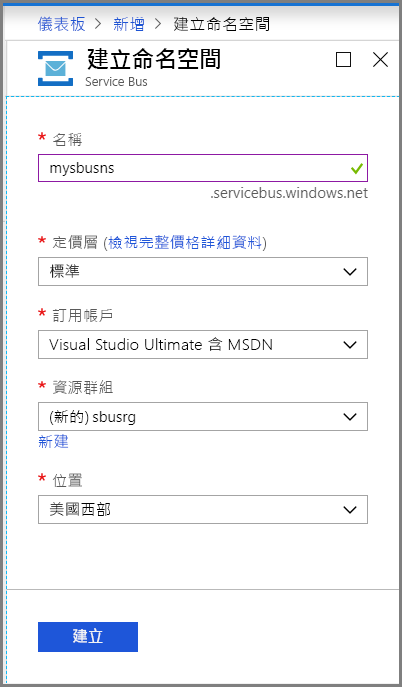
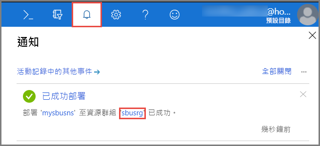
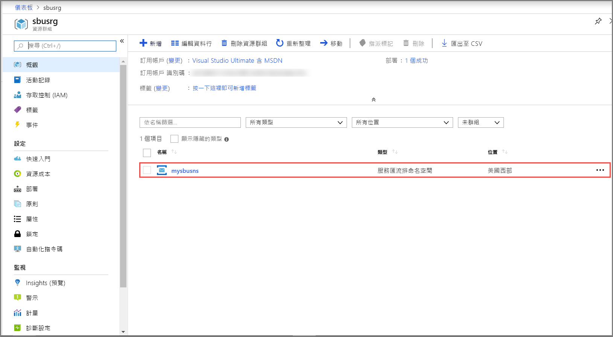
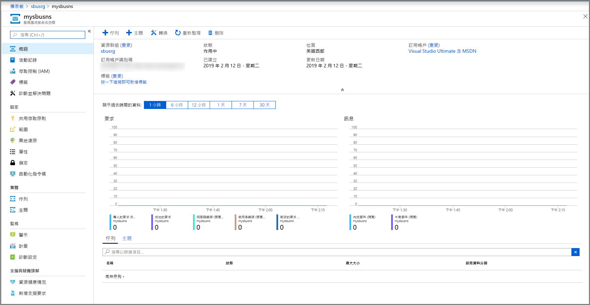
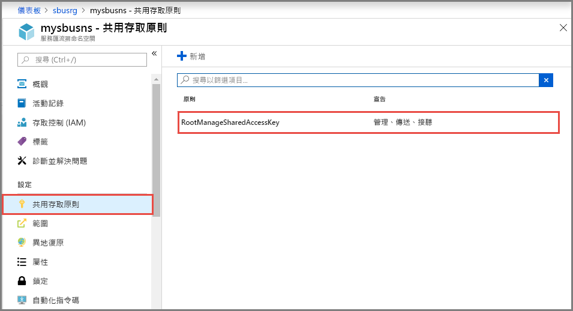
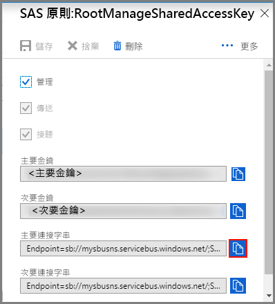

## 在 Azure 入口網站中建立命名空間
若要開始在 Azure 中使用服務匯流排傳訊實體，您必須先使用 Azure 中的唯一名稱建立命名空間。 命名空間提供範圍容器，可在應用程式內定址服務匯流排資源。

若要建立命名空間：

1. 登入 [Azure 入口網站](https://portal.azure.com)
2. 在入口網站的左側瀏覽窗格中，依序選取 [+ 建立資源]、[整合] 及 [服務匯流排]。

    
3. 在 [建立命名空間] 對話方塊中，執行下列步驟： 
    1. 輸入**命名空間的名稱**。 系統會立即檢查此名稱是否可用。
    2. 選取命名空間的定價層 (基本、標準或進階)。 如果您想要使用[主題和訂用帳戶](../articles/service-bus-messaging/service-bus-queues-topics-subscriptions.md#topics-and-subscriptions)，請選擇 [標準] 或 [進階]。 基本定價層不支援主題/訂用帳戶。
    3. 如果您選取了 [進階] 定價層，請遵循下列步驟： 
        1. 指定**傳訊單位**的數目。 進階層可讓您的資源在 CPU 和記憶體層級上獲得隔離，讓每個工作負載能夠獨立執行。 此資源容器稱為傳訊單位。 進階命名空間都有至少一個傳訊單位。 您可以為每個服務匯流排進階命名空間選取 1、2 或 4 個傳訊單位。 如需詳細資訊，請參閱[服務匯流排進階傳訊](../articles/service-bus-messaging/service-bus-premium-messaging.md)。
        2. 指定您是否要讓命名空間具有**區域備援功能**。 區域備援可免費在單一區域中的可用性區域間散佈複本，而提供更高的可用性。 如需詳細資訊，請參閱 [Azure 中的可用性區域](../articles/availability-zones/az-overview.md)。
    4. 針對 [訂用帳戶]，選擇要在其中建立命名空間的 Azure 訂用帳戶。
    5. 針對 [資源群組]，選擇將存留命名空間的現有資源群組，或是建立新的資源群組。      
    6. 針對 [位置]，選擇應裝載命名空間的區域。
    7. 選取 [建立] 。 此時系統會建立並啟用命名空間。 系統為帳戶提供資源時，您可能需要等幾分鐘。
   
        
4. 確認服務匯流排命名空間已成功部署。 若要查看通知，請選取工具列上的**鈴鐺圖示 (警示)**。 選取通知中的**資源群組名稱**，如下圖所示。 您會看到包含服務匯流排命名空間的資源群組。

    
5. 在資源群組的 [資源群組] 頁面上，選取您的**服務匯流排命名空間**。 

    
6. 您會看到服務匯流排命名空間的首頁。 

    

## 取得連接字串 
建立新命名空間會自動產生初始共用存取簽章 (SAS) 規則，其利用相關聯的主要和次要金鑰組，分別授與命名空間的所有層面的完全控制權。 請參閱[服務匯流排驗證與授權](../articles/service-bus-messaging/service-bus-authentication-and-authorization.md)，以了解如何建立進一步的規則，對一般傳送者和接收者的權限施加更多限制。 若要複製命名空間的主要和次要金鑰，請遵循下列步驟： 

1. 按一下 [所有資源]，然後按一下新建立的命名空間名稱。
2. 在命名空間視窗中，按一下 [共用存取原則]。
3. 在 [共用存取原則] 畫面中，按一下 **RootManageSharedAccessKey**。
   
    
4. 在 [原則：RootManageSharedAccessKey] 視窗中，按一下 [主要連接字串] 旁的複製按鈕，將連接字串複製到剪貼簿以供後續使用。 將此值貼到記事本或一些其他暫存位置。
   
    
5. 重複前一個步驟，複製 [主要金鑰] 的值並貼到暫存位置以供稍後使用。

<!--Image references-->

