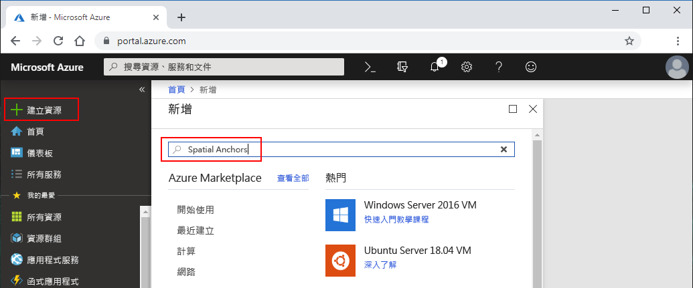
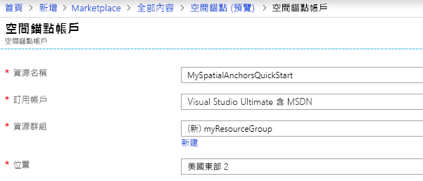
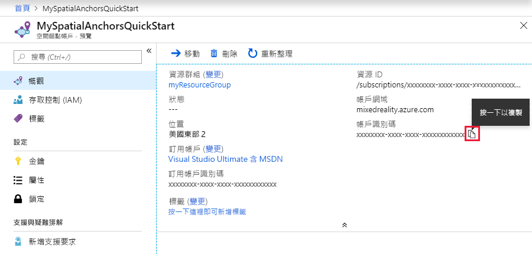
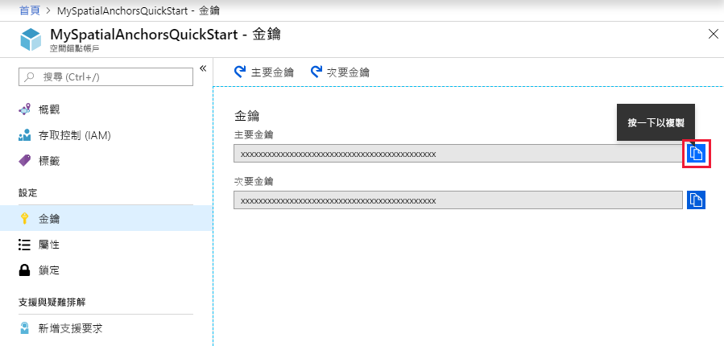

## 建立 Spatial Anchors 資源

1. 瀏覽至 <a href="https://portal.azure.com" target="_blank">Azure 入口網站</a>。

2. 在 Azure 入口網站的左側功能表中，選取 [建立資源]。

3. 在搜尋列中搜尋 "Spatial Anchors"。

   

4. 選取 [Spatial Anchors (預覽)] 以開啟對話方塊，然後選取 [建立]。

5. 在 [Spatial Anchors 帳戶] 表單中：

   1. 指定唯一的資源名稱。
   2. 選取要連結資源的訂用帳戶。
   3. 選取 [新建] 以建立資源群組，並將資源群組命名為 **myResourceGroup**，然後選取 [確定]。
      [!INCLUDE [resource group intro text](resource-group.md)]
   4. 選取將放置此資源的位置 (區域)。
   5. 選取 [新增] 開始建立資源。

   

6. 資源成功建立之後，您可以檢視資源屬性。 請記下資源的 [帳戶識別碼] 值，因為後續將需要此值。

   

7. 在 [設定] 下方選取 [金鑰]，並記下 [主要金鑰] 值。 此值是 `Account Key`，稍後將會用到。

   
